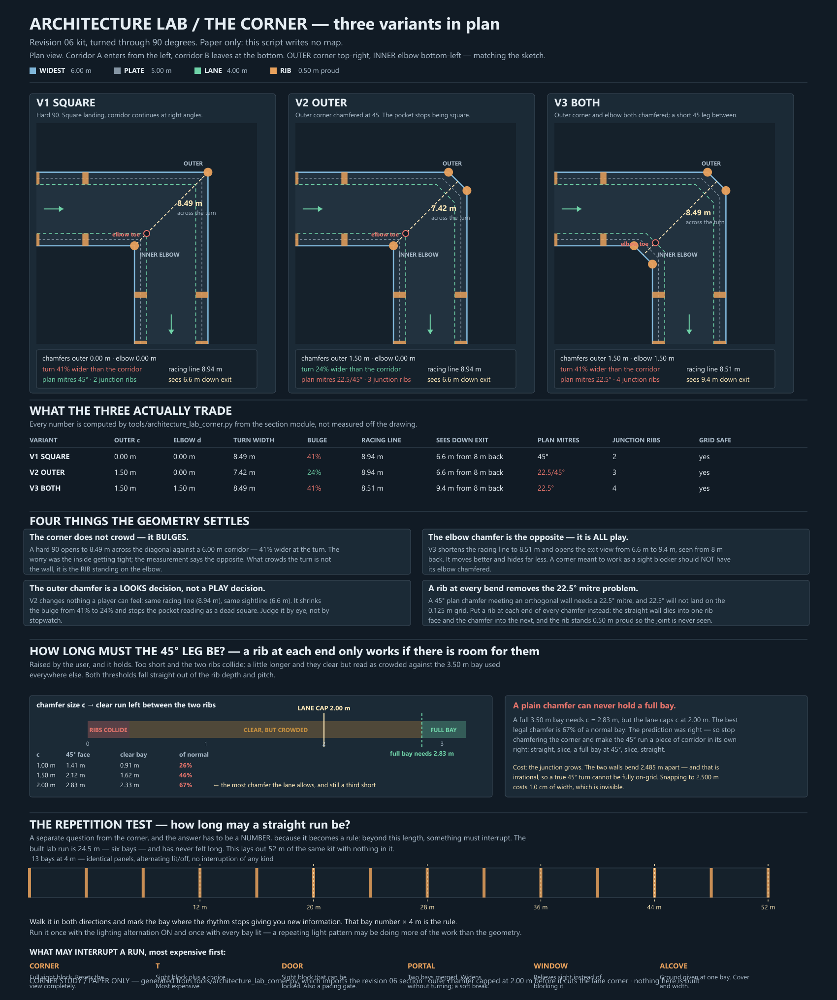
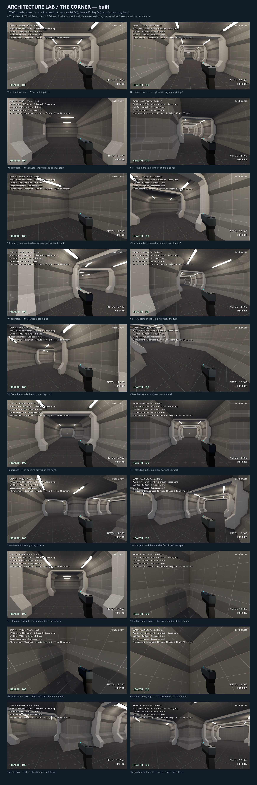

# Architecture lab — the corner, three variants

2026-09-22. Revision 06's straight run is signed off and lit; this is the piece
the plan document called "the part I am least sure of."

**V1 and V4 are now built and validated** — see [Built](#built) below. V2 and V3
remain paper only. The paper study came first and is kept in full, because the
measurements in it are what decided what got built.

`tools/architecture_lab_corner.py` is the single source of truth for the corner,
in the same way `tools/architecture_lab_section.py` is for the section. It
**imports** the section rather than restating it, so the two cannot drift. The
drawing script imports both. Every number on the sheet is computed, not measured
off the drawing.

## The three the user asked for

| | Outer corner | Inner elbow | |
|---|---|---|---|
| **V1 SQUARE** | square | square | Hard 90, square landing, corridor continues at right angles. |
| **V2 OUTER** | chamfered 1.50 m | square | The pocket stops reading as a dead square. |
| **V3 BOTH** | chamfered 1.50 m | chamfered 1.50 m | The walk space itself turns through two 45° bends. |

Two words, used precisely throughout, because the whole study depends on keeping
them apart:

- **Outer corner** — the 90° pocket you swing wide around. Chamfering it *adds*
  wall and *shrinks* the turn.
- **Inner elbow** — the 270° corner you clip. Chamfering it *removes* wall and
  *opens* the turn.

## What the geometry settles

### 1. The corner does not crowd. It bulges.

The concern going in was that the inside of the turn would get tight. The
measurement says the opposite, and by a wide margin:

| | Clear across the turn | vs the 6.00 m corridor |
|---|---|---|
| V1 square | **8.49 m** | +41% |
| V2 outer chamfer | **7.42 m** | +24% |
| V3 both chamfered | **8.49 m** | +41% |

A hard 90° between two 6.00 m corridors opens to 8.49 m on the diagonal, because
the diagonal of a square is √2 times its side. The turn is the *widest* place in
the corridor system, not the narrowest.

So what actually crowds a turn is not the wall — it is **the rib standing on the
elbow**. Its toe lands on the lane corner at (−2.00, +2.00) and it stands 0.50 m
proud. That is the thing a player clips backing out of a fight, and it is the
thing the elbow chamfer moves.

Worth noting that V3 with equal chamfers (c = d = 1.50) has *exactly* the same
8.49 m diagonal as V1. Cutting both corners by the same amount cancels. V3 is
not a smaller corner than V1 — it is the same corner with its edges taken off.

### 2. The outer chamfer is a looks decision, not a play decision

V2 changes nothing a player can feel. Same racing line (8.94 m), same sightline
(6.6 m down the exit from 8 m back), because the occluder and the inside of the
turn are both untouched. What it does is drop the bulge from 41% to 24% and stop
the pocket reading as a dead square.

That makes V2 cheap to decide: **judge it by eye, not by stopwatch.** If the
square pocket looks like unfinished space, chamfer it; if it reads as a landing,
leave it.

### 3. The elbow chamfer is the opposite — it is all play

| | Racing line | Sees down the exit, from 8 m back |
|---|---|---|
| V1 / V2 | 8.94 m | 6.6 m |
| V3 | **8.51 m** | **9.4 m** |

V3 shortens the path through the turn by 0.43 m and opens the view down the exit
corridor by **2.8 m** — a 42% increase in how much of the next corridor you can
read before you commit to the turn.

That is the real trade, and it cuts both ways:

- It **moves better.** Less clipping, a cleaner racing line, better for a retreat.
- It **hides far less.** A corner is the strongest sight blocker in the kit, and
  chamfering its elbow is precisely what degrades that.

**A corner being used as a sight blocker should not have its elbow chamfered.**
That is a level-design rule, not an aesthetic preference, and it means the answer
may well be "both, in different places."

### 4. A rib at every bend removes the 22.5° mitre problem

> **Superseded by the build.** The reasoning below is sound but the measurement
> in *How long must the 45° leg be?* killed it: no legal chamfer is long enough
> to hold two ribs without crowding. What was built instead puts **no rib at any
> bend** and simply overlaps the wall solids, so the 22.5° surface is never
> created at all. Kept because it is why the leg-length question got asked.

This was the open risk in `architecture-lab-plan.md` — the walkable facets are
deliberately off 45° (63.43°, 56.31°, 51.34°) while the overhangs sit exactly on
it, so a turn has to reconcile two families.

At a hard 90° (V1) every facet mitres against its twin at 45° in plan, which is
grid-safe and should simply work. At a 45° plan chamfer, the wall turns through
45°, so the mitre bisector is **22.5°** — and 22.5° will not land on the 0.125 m
grid at any useful length. Two of the three variants need it.

The way out is not to mitre at all:

> Put a rib at each end of every chamfer. The straight wall dies into one rib
> face and the chamfer wall dies into the next. The rib stands 0.50 m proud, so
> the joint is never seen from any angle a player can occupy.

It is also the honest structural reading — a column at every change of
direction — and it is why the junction rib count rises from 2 (V1) to 3 (V2) to
4 (V3). That is the real cost of the chamfers, and it is a cost in brushes, not
in risk.

### The outer chamfer has a hard cap

The outer chamfer face lies on the line X − Z = 2·WIDE − c, and the outer lane
corner sits on X − Z = 2·LANE. They meet when **c = 2·(WIDE − LANE) = 2.00 m**.
Beyond that the chamfer cuts the protected lane, so 2.00 m is a real ceiling and
the module asserts it. 1.50 m was chosen to leave margin.

## How long must the 45° leg be?

Raised by the user after seeing the rib-at-every-bend rule, and it holds up: a
rib at each end of a chamfer only works if the chamfer is long enough to hold
them. Too short and the two ribs collide; a little longer and they clear but
read as crowded against the 3.50 m bay used everywhere else.

Both thresholds fall straight out of the rib depth (0.50 m) and pitch (4.00 m).
A chamfer of size *c* produces a 45° face of length *c*√2, and a rib at each end
consumes 0.50 m of it:

| Chamfer *c* | 45° face | Clear bay left | Of a normal bay | |
|---|---|---|---|---|
| 0.354 m | 0.50 m | 0.00 m | 0% | **ribs collide below this** |
| 1.00 m | 1.41 m | 0.91 m | 26% | crowded |
| 1.50 m | 2.12 m | 1.62 m | 46% | crowded |
| **2.00 m** | 2.83 m | 2.33 m | **67%** | **the most the lane allows** |
| 2.83 m | 4.00 m | 3.50 m | 100% | a full bay — but illegal |

**A plain chamfer can never hold a full bay.** A full 3.50 m bay needs
*c* = 2.83 m, and the lane caps *c* at 2.00 m. The best legal chamfer is two
thirds of a normal bay, so the prediction was right: ribs at both ends of a
corner chamfer will look crowded at every size that actually fits.

### So stop chamfering the corner

The way out is the user's own: don't treat the 45° run as a cut on a corner,
treat it as **a piece of corridor in its own right** — straight, slice, a full
bay at 45°, slice, straight. The junction grows, which is what they predicted
two passes earlier.

That construction has its own governing number. The inside of a turn always
bends before the outside, and for a 45° bend at constant width the two walls
bend apart by:

> offset = 2·h·(√2 − 1) = **2.4853 m** at the 6.00 m corridor

**That is irrational, so a true 45° turn cannot put all of its vertices on the
0.125 m grid.** Not at this width, not at any width. Snapping the offset to
2.500 m gives a leg 6.0104 m wide — **1.0 cm** over nominal, which is invisible
and entirely acceptable. It is recorded here so nobody spends an afternoon
hunting for an exact number that does not exist.

A second consequence matters more for the ribs: because the two walls bend
2.485 m apart, **there is no single station at which the corridor bends**. A rib
spans the corridor, so a cross-corridor rib cannot sit "at the bend" — there
are two, and they are metres apart. The turn therefore has three zones:

| Zone | Length | What is happening |
|---|---|---|
| Transition in | ~2.47 m | outer wall diagonal, inner wall still straight |
| **True leg** | **4.00 m** | both walls diagonal — the only place a cross-corridor rib can sit |
| Transition out | ~2.47 m | inner wall diagonal, outer wall already straight |

Ribs go at the two ends of the true leg, exactly one pitch apart, so the rhythm
is unbroken through the turn. The transitions are the corner's bulge and carry
no rib. That is **V4**, and it is the only variant that keeps the 4 m rhythm
through a turn.

Worth noting what this says about V1: the square landing is the only variant
where the rhythm has a clean place to *stop* and restart, because everything
stays orthogonal. That is an argument for it that had not appeared before.

## What this does not answer

- **The vertical mitre.** This study is entirely in plan. How the nine section
  facets actually fold around the corner in 3D — particularly the ceiling chamfer
  meeting the rib beam — is not resolved here and may still bite.
- **T junctions.** A T is three arms, so it has two elbows and no outer corner.
  Different problem, and the plan sheet's provisional circuit wants one.
- **Which to build.** All three are cheap once the rib-at-every-bend rule is
  taken; the sensible move is to build all three in one lab run and walk them
  back to back.

## The repetition test

A separate question, and the user raised it in the same breath: **how long may a
straight run be before it stops giving the player information?**

The answer has to be a *number*, because it becomes a level-design rule — beyond
this length, something must interrupt. The built run is 24.5 m (six bays) and has
never felt long, so the test lays out **52 m — thirteen bays** — of identical kit
with nothing in it at all.

Method: walk it in both directions and mark the bay where the rhythm stops
telling you anything new. That bay number × 4 m is the rule. Run it **twice** —
once with the lit/off alternation on, once with every bay lit — because a
repeating light pattern may be carrying more of the interest than the geometry,
and `S.BAY_LIGHTS` makes that a one-word change.

What may interrupt a run, most expensive first:

| | |
|---|---|
| **CORNER** | Full sight block. Resets the view completely. |
| **T** | Sight block plus a choice. The most expensive interruption. |
| **DOOR** | Sight block that can be locked. Also a pacing gate. |
| **PORTAL** | Two bays merged. Widens without turning; a soft break. |
| **WINDOW** | Relieves sight instead of blocking it. |
| **ALCOVE** | Ground given at one bay. Cover, and a change of width. |

The corner study feeds this directly: V1 and V2 are full sight blocks, V3 is a
substantially weaker one. If the repetition rule lands at, say, 32 m, then a V3
corner may not discharge it on its own.

## Built

**V1 and V4 are built and validated as one continuous walk.** 473 brushes,
**1,268 validation checks, 0 failures.** `F8` opens it in game (`F7` is the
straight run).

| | |
|---|---|
| Walk | **97.66 m** end to end |
| Straight before the first corner | **54.00 m** — the repetition test |
| V1 | 90° vertex at (0, 52), mitred |
| V4 | 45° vertices at (20, 52) and (24, 48), 3.90 m true leg |
| Ribs | 21, on one 4 m rhythm measured **along the centreline** |
| Ribs skipped inside turns | 3 (at 52, 56 and 80 m) |
| Bays | 21, alternating lit / off |

### No rib sits at a bend, and the wall solids just overlap

The user's call, once the measurement showed a legal chamfer can never hold a
full bay. It turned out to be the better construction for a second reason:
**no mitre face is ever built.** The wall solids of two runs simply overlap
inside the corner, and the visible edge is wherever the two wall *planes*
intersect — which lands on the grid even in the cases where a mitre face's own
vertices would not have. The 22.5° problem never arises because the 22.5°
surface is never created.

### The mitre does the hard arithmetic by itself

Each run is cut on the bisector plane at each end. That single rule produces
**both** variants: a 90° vertex gives V1's square outer corner and square inner
elbow outright, and a 45° vertex gives V4 — including the 2.485 m offset between
where the inner and outer walls bend. Nobody computes that offset; it falls out
of the bisector. The irrational number is still there, it just never has to be
typed in.

### The rib rhythm carries across the turns

Ribs sit on one global 4 m beat measured along the centreline, not restarted
after each corner, which is what the user asked for. A station inside a turn is
**skipped rather than nudged**, so the beat never drifts. V1 swallows two
stations and reads as a deliberate 12 m pause — appropriate for a landing. V4
swallows one, and **a rib stands inside the 45° leg**, which is the thing the
paper study said was impossible with a chamfer.

### What the validator covers

1,268 checks: floor flat at Y = 0 every 0.5 m for the whole path (a mitre must
not leave a lip); a ceiling present at every sample (a mitred slab must not
leave a hole); the protected lane clear either side at three heights; both ends
sealed; the player walks all 97.66 m including both turns without climbing; and
jamming the wall never lifts them.

One validator note worth keeping: probing to exactly `LANE_HALF` fails at
**every** rib, because the toes sit exactly on x = 2.00 by design — opposite toes
are what define the 4.00 m lane. The probe runs to 1.98 so it tests intrusion
rather than tangency, the same fix the straight run's validator already carries.

### Still open

- **V2 and V3 are not built.** With the rib removed from the bend, V2 is a small
  cosmetic cut on V1 that can be added in minutes once V1 has been looked at.
- **The 45° faces** use a unit tangent basis so they keep metric UVs, but that
  has only been checked in the renders, not measured.
- **The repetition number** is not answered by building it — that needs a human
  walk. The 52 m straight is there to be walked.

## Scope and paths

- `tools/architecture_lab_corner.py` — the corner module. Imports the section,
  self-checks on every run (grid, lane intrusion, chamfer cap, elbow toe). Run it
  directly to print the comparison table.
- `tools/draw-architecture-lab-corner.py` — the sheet. Imports both modules.
  Paper only; touches no map.

- `tools/bootstrap-architecture-lab-corners.py` — one-time map generator, never
  part of a normal rebuild. Refuses an existing map without `--overwrite`.
- `tools/write-architecture-lab-corner-scene.py` — regenerates the scene; run it
  after changing the path, a tier or a lighting constant, then rebuild.
- `tools/rebuild-architecture-lab-corners.ps1 -Validate -Capture` — the normal
  rebuild. `tools/draw-architecture-lab-corner-built.py` assembles the sheet.

The `.map` is the editable source now; the bootstrap would discard TrenchBroom
edits. The straight run is untouched and still passes its own 1,037 checks.

## Recommendation

Build **all three in one lab run**, as three corners on a single circuit, with the
52 m straight as the approach to the first one. One rebuild, one walk, and the
comparison is back to back rather than from memory. The rib-at-every-bend rule
makes all three the same kind of work.

If only one gets built: **V2**. It is the only variant that changes how the corner
*looks* without changing how it *plays*, so it can be judged on its own terms —
and it keeps the sight block that makes a corner worth having.
