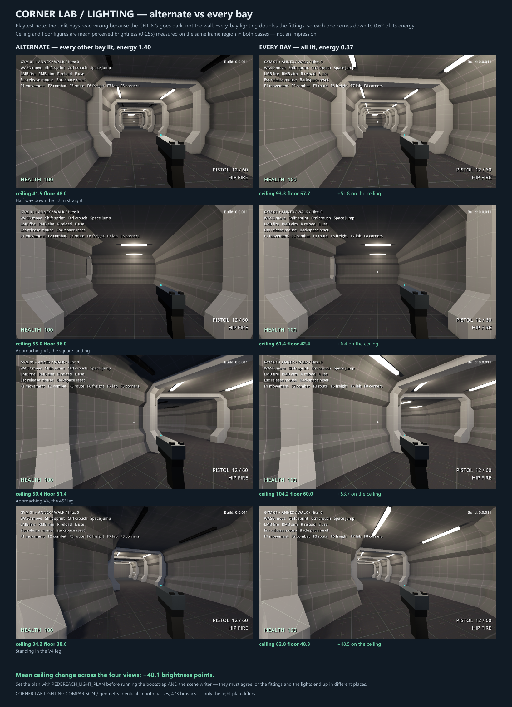

# Corner lab — playtest 01

2026-09-22. The user walked the built corner lab (`F8`): 97.66 m, a 54 m
straight, V1 square, then V4's 45° leg. Four findings, all of them decisions
rather than bugs.

## 1. 52 m is the ceiling for a straight run

> "52m straight - was ok. i think that's pushing our limits."

**The repetition rule: 52 m is the maximum, not a comfortable length.** A run
approaching it must be interrupted before the end, not at it.

The important half of the feedback is that the interrupter list was too narrow.
The paper study only listed **sight** blockers; the user wants **navigation**
obstacles as well — things that change how you move, not just what you can see:

| | What it does | Blocks sight | Changes movement |
|---|---|---|---|
| **Corner** | full reset of the view | yes | turns you |
| **T / 4-way** | sight block plus a choice | yes | turns you |
| **Door** | sight block that can be locked | yes | stops you |
| **Fallen debris** | forces a detour around it | partly | **yes — walk around** |
| **Low cables / collapsed panel** | forces a crouch | no | **yes — crouch** |
| **Portal bay** | widens without turning | no | no |
| **Window** | relieves sight rather than blocking it | no | no |
| **Alcove** | ground given at one bay | no | slightly |

The crouch and walk-around entries are new and they are the interesting ones,
because they cost the player *time and posture* rather than sightline. A
corridor that has been damaged is also the first piece of narrative the kit can
carry — this is a colony under attack, and a hallway that is merely long is a
hallway nothing has happened in.

None of these are designed yet. Footprints, clearances and the crouch height
against `crouch_height = 1.1` all need a pass.

## 2. Chamfer for a single turn, square for a junction

> "i like the chamfered portion of the hallway better than the completely square
> intersection - but the square one seems to work better maybe for a T or a
> 4way intersection - where the chamfered may make a large 'lobby' in between
> the junctions - the square would be more compact. for just a single turn the
> chamfered one seems better."

This is the first real rule the corner work has produced, and it is better than
either variant winning outright:

> **Single turn → V4, the 45° leg. Junction (T or 4-way) → V1, square.**

The reasoning holds up geometrically. A 90° turn bulges to 8.49 m across the
diagonal already (41% wider than the corridor). Chamfering *one* corner of a
single turn trims that. But a T has **two** inner elbows and a 4-way has
**four**, and chamfering each one compounds: every chamfer removes wall and
opens the middle, so a chamfered 4-way stops being a junction and becomes a
room. "Lobby" is exactly right, and it is a thing you would want sometimes and
not by accident.

Square stays compact because nothing is removed. That is the right default when
the junction's job is to be a decision point rather than a place.

**This changes the T study before it starts.** The T should be built square,
and the question for it is not "chamfer or not" but how the rib rhythm resolves
when three arms meet — which the bisector rule does *not* answer, because a
bisector needs exactly two directions.

## 3. The rib rhythm is right

> "rib beat feels good - before and after turn - and i like the single in the
> middle of the chamfer - that feels good."

Both halves of the rib decision are confirmed:

- **One global 4 m beat measured along the centreline**, never restarted after a
  turn, with a station inside a turn **skipped rather than nudged** so the beat
  cannot drift.
- **The single rib inside the 45° leg.** This is the thing the paper study said
  a chamfer could never have — it needs a full bay, which a chamfer capped at
  2.00 m cannot provide, and which the 45° leg can.

Keep both. They are now load-bearing decisions, not provisional ones.

## 4. Unlit bays — the ceiling is the problem, and every-bay fixes it

> "i'm still a little sketch on the 'unlit' sections - the celing is dark - but
> i think that's ok to move forward with.. we may just need to lower individual
> lights, and just light every section."

The diagnosis was right and it is specific: **it is the ceiling that reads
wrong, not the wall.** An off bay's wall still catches spill from its
neighbours at 13 m range; its ceiling does not, because the light node sits at
3.375 and the soffit is at 3.75, so a dark bay's ceiling has nothing above it.

Both plans were built and measured on identical geometry — 473 brushes, only the
light plan differs.



| View | Alternate | Every bay | Ceiling change |
|---|---|---|---|
| Half way down the straight | 41.5 | 93.3 | **+51.8** |
| Approaching V1 | 55.0 | 61.4 | +6.4 |
| Approaching V4 | 50.4 | 104.2 | **+53.7** |
| Standing in the V4 leg | 34.2 | 82.8 | **+48.5** |
| | | | **mean +40.1** |

Mean perceived brightness, 0–255, same frame region in both passes.

**Every bay lit at 0.62 energy (0.87 against 1.40) more than doubles the ceiling
and lifts the floor by only about 9 points.** That asymmetry is the whole point:
the ceiling was the thing in deficit, and the fix targets it without washing out
the floor the way raising ambient would. Ambient remains the wrong lever, as the
straight run already recorded.

It does **not** flatten the corridor. Rib shadows still cross the bays and the
chamfers still catch, because the contrast is still coming from many local
sources rather than from a global lift.

V1's approach gained only +6.4 because that view already looks straight at a lit
bay — worth knowing, because it means the plan matters most where the player is
*between* fittings, which is most of the time.

**Switched.** `every_bay` is now the default: **lit by default, off by
deliberation.** An off bay stops being a rhythm and becomes what it was always
meant to be — a broken fitting, used rarely and on purpose. The user also
proposed making that dynamic in a mission — bugs cut the power, the hallway goes
dark, one or two bays flicker with sparks — which is recorded as
[FR-006](future-refinements.md#fr-006-power-loss-as-a-mission-event).

To go back to the alternating plan for a comparison:

```
$env:REDBREACH_LIGHT_PLAN='alternate'
python tools/bootstrap-architecture-lab-corners.py --overwrite
python tools/write-architecture-lab-corner-scene.py
powershell -File tools/rebuild-architecture-lab-corners.ps1 -Validate -Capture
```

The plan must be set for **both** the bootstrap and the scene writer. They read
the same `C.LIGHT_PLANS` entry, and if they disagree the emissive fittings and
the OmniLight3D nodes end up in different bays — the same class of fault as the
tier-name bug the straight run already carries a note about.

## 5. The T, built

Built square, per the rule above. The walk is now **107.66 m**, 559 brushes,
**1,476 validation checks, 0 failures**. Views 11–15 on
`architecture-lab-corner-built.png`.

Construction: the through corridor simply **omits its wall — and its footing —
across the opening**, and the branch supplies its own walls from that line
outward. The footing has to go as well as the wall: it is charcoal and sits at
floor level, so leaving it under the branch's dark floor plate would z-fight
across the threshold. The branch's floor and ceiling run back *past* the wall
line and overlap the through corridor, which keeps one continuous dark plate
through the junction — no texture change, so no supporting geometry is owed.

**The bisector rule genuinely does not apply.** V1 and V4 were both built by
cutting each run on the bisector plane at its ends, which needs exactly two
directions. A T has three, so it is built as a through corridor plus a branch
rather than as a path with a vertex. That is not a workaround; it is what a T is.

### One bug the build found

Excluding fittings wherever a *rib* could not stand left the T junction — the
decision point, and the place a player most needs to read — as the **darkest
spot in the whole corridor**. A rib needs two walls; a fitting only needs a
ceiling. The two exclusions are now separate, and the junction carries its own
fitting.

### Three things the user's walk of the T then fixed

**A hole in the floor at each jamb.** The footing is cut back over the full
opening — 2 x WIDE, 6.00 m — but a floor plate is only 2 x FLOOR_HALF, 5.00 m,
so a 0.50 m strip at each jamb had nothing in it at all. That was the dark notch
in the corner. The branch now lays a **threshold plate as wide as the opening**
over the overlap, and narrows to a normal floor plate past the wall line.

**The jamb corners had a real void.** Not a shading artefact — actual missing
geometry. A T has no mitre, so the through wall is cut square at the opening and
the branch wall starts square at the wall line. Wherever the profile is inboard
of WIDEST, neither solid reaches the pocket corner between them:

| Height | Profile reach | Void |
|---|---|---|
| Floor | 2.500 | 0.50 x 0.50 m |
| Plinth | 2.750 | 0.25 x 0.25 m |
| **Panel, 1.25–2.50** | **3.000** | **closed** |
| Rib beam | 2.500 | 0.50 x 0.50 m |
| Ceiling | 2.250 | 0.75 x 0.75 m |

Wide at both extremes, closed in the middle — which is exactly the funnel shape
the user outlined in red, and why it appeared at the top and the bottom but not
across the middle of the wall. V1 and V4 never have it because their bisector
cuts make the two profiles meet on that plane.

The fill is one prism per profile band whose plan rectangle **shrinks as the
profile reaches out**, so its faces follow the profile rather than cutting
across it. Two earlier attempts failed first and are worth recording: a
full-height flat, which the user rejected because the wall sat flush with it and
it read as a pseudo pillar; and a box bounded by a vertical plane at each band's
innermost reach, which protruded into the corridor as dark wedges because the
real face slopes out past that plane. A single constant extension cannot work
either — the profile's innermost reach differs by height, so any one value
protrudes somewhere.

**The first rib was a different distance on every arm.** The beat cannot deliver
symmetry at a junction, because a junction does not land on it. Measured from
the junction centre the three arms were at 5.66 m, 6.34 m and 4.00 m.

They are now all at a **junction setback of 6.00 m** — 1.5 pitches — which
leaves **2.75 m of clear wall from jamb to rib face on every arm**. 6.00 m was
chosen because it is both the average of what the T was doing unaided, as the
user asked for, *and* exactly what the V1 corner already does: V1's skipped
stations leave ribs 6.00 m either side of its vertex, and that is the beat the
user walked and said felt right. Stations near a junction are excluded from the
global beat and the setback ribs are pinned instead.

## What this leaves open

- **The interrupter kit.** Debris, low cables and a door all need footprints,
  clearances and a crouch check against `crouch_height = 1.1`. None designed,
  and this is the piece the mission redress actually needs.
- **The branch jamb spacing**, above.
- **A 4-way**, if the mission needs one. Same construction as the T with two
  branches; the rule says square.
- **A room.** Still the untested claim — that the registers below 2.50 m carry
  out of the corridor.
