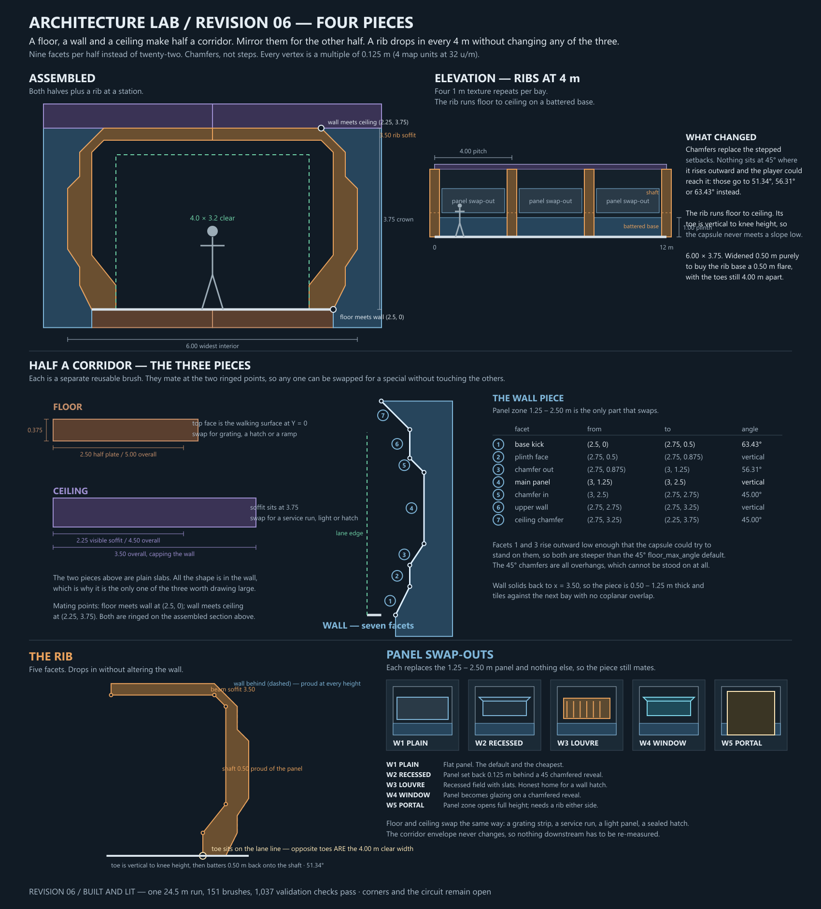
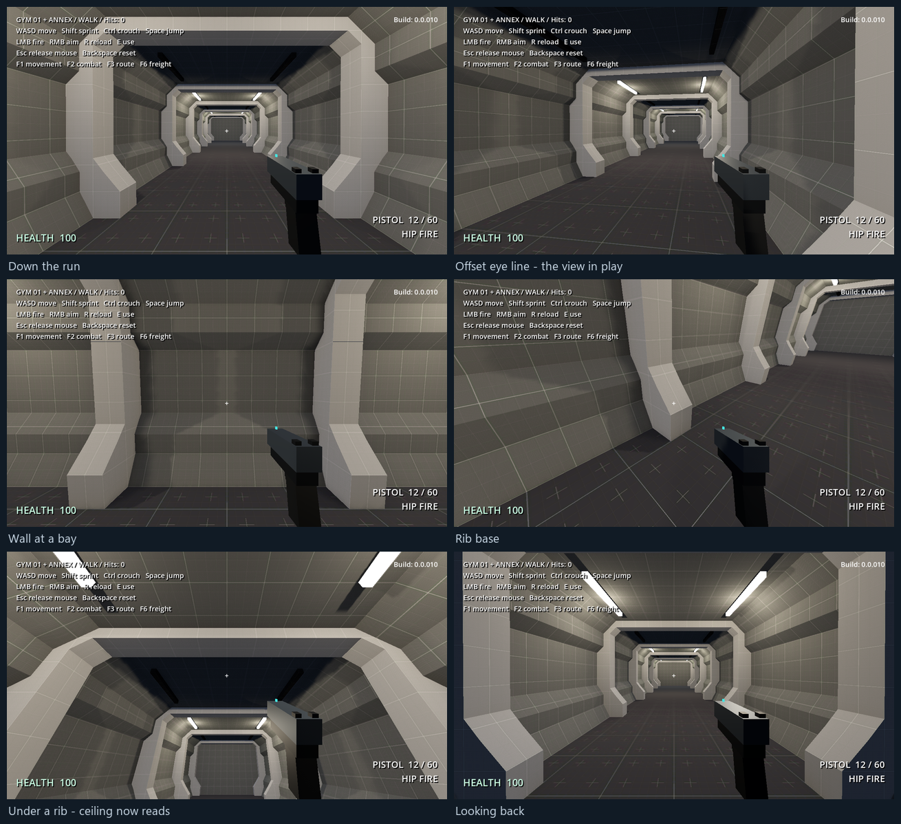

# Architecture lab — revision 06, four pieces

2026-09-21. Revision 06 rebuilds the corridor as **four reusable pieces** rather than one carved profile, at the user's direction. Approved and **built as a single 24.5 m straight run**.






References remain in `references/architecture-lab/`, now joined by three Doom 3 corridor shots the user supplied showing chamfered ribs, an octagonal wall and pilasters that land on a plinth rather than running to the floor.

## Why revision 05 was set aside

The user walked the revision 05 stage 1 build and rejected the section on three counts, all fair:

1. **Too many 90° angles.** The twenty-two-facet wall was a stack of small orthogonal setbacks. Where the references chamfer, revision 05 stepped — "we shouldn't build buildings out of Lego."
2. **The rib ran to the floor.** In every supplied reference the pilaster lands partway down the wall, on a plinth. Revision 05's rib foot sat at 1.25 m but read as continuous with the wall below it.
3. **It read as an ultra-modern skybridge, not a sci-fi base.** 7.25 m wide and 4.25 m high with a pale recessed panel field is an airport walkway, not a pressurised industrial colony.

The direction given: block out the corridor as a floor brush, a wall brush and a ceiling brush that can be reused and swapped; then a rib that drops in every texture repeat or two; lock it in 2D first; and do it with far fewer facets. Nothing has to be straight, nothing has to be highly detailed — it just needs *some* interest.

## The four pieces

`tools/architecture_lab_section.py` is the single source of truth. Both drawing scripts import it and it self-checks on every run. Coordinates are (horizontal distance from corridor centre, height) in metres, **right side** — mirror for the left. Every value is a multiple of 0.125 m (4 map units at 32 units/metre).

### FLOOR

Half plate, centre to wall foot. **2.50 half / 5.00 m overall**, top face at Y = 0, 0.375 m thick. One facet.

Swap-outs: grating strip, sealed hatch, a ramp where a level change is wanted.

### WALL — seven facets

| # | Facet | From | To | Angle |
|---|---|---|---|---|
| 1 | **Base kick** | (2.50, 0) | (2.75, 0.50) | **63.43°** |
| 2 | Plinth face | (2.75, 0.50) | (2.75, 0.875) | vertical |
| 3 | **Chamfer out** | (2.75, 0.875) | (3.00, 1.25) | **56.31°** |
| 4 | **Main panel** | (3.00, 1.25) | (3.00, 2.50) | vertical |
| 5 | Chamfer in | (3.00, 2.50) | (2.75, 2.75) | 45° |
| 6 | Upper wall | (2.75, 2.75) | (2.75, 3.25) | vertical |
| 7 | Ceiling chamfer | (2.75, 3.25) | (2.25, 3.75) | 45° |

Wall solids back to x = 3.50, so the piece is 0.50 – 1.25 m thick and tiles against its neighbours with no coplanar overlap.

**No facet sits at 45° where it rises outward and the player could reach it.** Facets 1 and 3 are the two the capsule could try to stand on, so they are 63.43° and 56.31°. The remaining 45° chamfers are all overhangs — they lean *in* as they rise, so they cannot be stood on at any angle. 45° is exactly Godot's `floor_max_angle` default and `gym_player.gd` never assigns it, so anything at 45° that faces up is a coin flip; the check rejects any outward-rising facet below 2 m that is within 3° of it.

### CEILING

Half soffit, wall top to centre. **2.25 half visible / 4.50 m overall** at 3.75 m, plus a 3.50 m overall cap sitting over the wall. One facet.

Swap-outs: service run, light panel, sealed ceiling hatch. This is the obvious carrier for lighting, and lighting stays deferred until the section is signed off.

### RIB — five facets

(2.00, 0) → (2.00, 0.50) → (2.50, 1.125) → (2.50, 3.25) → (2.25, 3.50) → (0, 3.50)

**It runs floor to ceiling on a battered base.** An earlier draft stopped it at 1.00 m on the plinth, which was a misreading — a pillar that ends halfway down a wall reads as a hanging fixture, not as structure.

The **toe sits exactly on the protected lane line at x = 2.00**, so the clear width between opposite toes *is* the 4.00 m lane. The pillars define it rather than being placed near it, which is a better reason for that number than any I had before. The **toe is vertical to knee height (0.50 m)** and the batter starts above it, so the only thing the player capsule meets below the knee is a flat wall face — no slope for it to mistake for a stair. The base then **batters back 0.50 m** (51.34°) onto the shaft at x = 2.50.

Flare divided by rise *is* the angle, so a wide flare and a low foot are in direct conflict. Going flatter to bring the foot down is precisely what would make the capsule walk it. Keeping the toe vertical resolves both: the foot reads low and the slope stays 6.34° clear of the threshold.

That flare is the reason the corridor is 6.00 m wide rather than 5.50 m. At 5.50 there was only 0.25 m between the lane line and the shaft, so the base read as a straight post. Widening the whole section by 0.50 m — floor, wall and ceiling all pushed out 0.25 m per side — doubles the flare without touching the walking lane, which is still 4.00 m between the toes.

The rib is proud of whatever is behind it at every height:

| Height | Behind it | Proud by |
|---|---|---|
| 0.00 | wall base kick | 0.500 m |
| 0.25 | wall base kick | 0.625 m |
| 0.50 | plinth face | 0.583 m |
| 1.80 | main panel | **0.500 m** |
| 3.00 | upper wall | 0.250 m |

The beam crosses the ceiling with its soffit at 3.50 m. Pitch is **4.0 m** — four 1 m Kenney texture repeats, so every rib lands on a texture seam — and 0.50 m deep, leaving 3.50 m of clear bay.

### Facet count

| | Facets |
|---|---|
| Half a corridor (floor + wall + ceiling) | **9** |
| The rib | **5** |
| Revision 05, for comparison | 22 per side, plus 8 for the rib |

## Envelope and clearances

Checked by the module on every run, not estimated:

| | |
|---|---|
| Widest interior | **6.00 m** (revision 05: 7.25 m) |
| Crown | **3.75 m** (revision 05: 4.25 m) |
| Walking plate | 5.00 m |
| Protected lane | 4.00 × 3.20 m, untouched |
| Wall at y = 3.20 | x = 2.75 — clear by 0.75 |
| Rib at y = 3.20 | x = 2.50 — clear by 0.50 |
| Rib beam soffit | 3.50 m — clear by 0.30 |
| Rib toe vs protected lane | x = 2.00 — tangent; opposite toes give exactly 4.00 m clear |
| Panel pocket at eye height | 0.500 m deep |

6.00 m is still well under revision 05's 7.25 m, and the walking lane never changed — the extra width is spent entirely on the rib base and on wall thickness. All chamfers start **above** 3.25 m, so nothing slopes across the protected head height.

## Swap-outs

The point of the piece split. Each swap replaces the **1.25 – 2.50 m panel zone and nothing else**, so the wall still mates with the floor and ceiling and nothing downstream has to be re-measured.

| | |
|---|---|
| **W1 Plain** | Flat panel. The default and the cheapest. |
| **W2 Recessed** | Panel set back 0.125 m behind a 45° chamfered reveal. |
| **W3 Louvre** | Recessed field with slats. The honest home for a wall hatch. |
| **W4 Window** | Panel becomes glazing on a chamfered reveal. |
| **W5 Portal** | Panel zone opens full height; needs a rib either side. |

Floor and ceiling swap the same way. A bay gets its character from which panel is in it, not from a different corridor.

## What is deliberately not decided yet

- **Corners and junctions.** The overhang chamfers are 45° and should mitre cleanly, but the walkable facets are deliberately not (51.34°, 56.31°, 63.43°), so a turn has to reconcile two different families of angle. That is an assertion until one is built, and it is the weakest claim in this document.
- **The circuit.** The routing on the second sheet — spine, corner, T, east arm, Mars exterior — still carries revision 05 thinking. Its coordinates are provisional and were only updated enough to stay self-consistent. It is ahead of where the work is.
- **Room vocabulary.** The plinth and panel registers below 2.50 m are what should carry into rooms; the upper wall and ceiling are corridor-specific. Confirm by building one room before rolling the language out.

## Built

One straight run, generated directly from the chains in `tools/architecture_lab_section.py`, so the map cannot disagree with the drawings. **151 brushes. 1,037 validation checks pass, 0 failures.** (139 unlit, plus twelve light strips.)

| | Solids |
|---|---|
| Floor plate and wall footings | 3 |
| Wall, seven facets running the full 24.5 m | 14 |
| Ceiling slab | 1 |
| Seven ribs at 4 m | 119 (17 each) |
| Sealed ends | 2 |

139 against revision 05's 211 for the same length — fewer facets *and* a wider rib pitch, so it won on both counts. The wall is still only 14 solids for the whole run; the ribs are 86% of the budget, exactly as measured before.

### What the validator covers

Lane clear for the full run (probed at 3.98 m so it tests intrusion rather than tangency against the toes, which sit exactly on the line); floor flat at Y = 0 down the lane; **the rib toe measured vertical at 0.15, 0.30 and 0.45 m on both sides of every rib**; the wall base kick measured against the player's actual `floor_max_angle`; rib beam soffits at or above 3.50 m sampled across the full lane width; both ends sealed; walk out, sprint back.

### Two things the build settled

**Jamming into the wall cannot lift the player.** A separate test drives the player diagonally into the wall for 900 frames and asserts the maximum height reached stays under 0.35 m. It does. The vertical toe is doing its job.

**A player who drifts into a bay is stopped by the next rib.** My first version of that test demanded the player complete the return sprint while pushing into the wall, and it failed at z = -10.55. That is correct behaviour, not a fault: the shaft stands 0.5 m proud, so running diagonally into a 0.5 m deep bay means meeting the next pillar face on. The test now asserts only that the player never climbs, which is the thing that would actually be a bug. Worth knowing for encounter design — the bays are shelter, not a running lane.

### Materials split by element, not by height

The first build assigned materials by height register — plinth one value, panel another, upper wall a third — and the wall read as three unrelated bands rather than one surface. It is now split the way a texture set would actually be authored:

| Zone | Material | Brightness |
|---|---|---|
| **Rib**, toe to beam | GreyPale | 151 / 255 |
| **Bay** — the whole bay: wall at every height, plus the ceiling between the beams | GreyMedium | 97 / 255 |
| Floor plate | `Dark/texture_06`, continuous, unchanged | 53 / 255 |
| Light strips | `Emissive/texture_01`, a real emissive material | — |

Two zones plus the floor. The structure is the *lighter* zone and the bay falls away behind it, which is what the references do and what the lighting reinforces: the frames catch the light and the recesses go dark. It also shrank the jump down to the floor from 98 brightness points to 44.

## Lighting

**The recess was already there.** The rib beams hang at 3.50 and the ceiling soffit sits at 3.75, so every bay has a 0.25 m coffer between the beams before any lighting work is done. Nothing had to be cut. That was accidental, but it is why recessed lighting cost six brushes instead of thirty.

| | |
|---|---|
| Strip | 0.125 m wide × 2.00 m long, face at 3.625 — set 0.125 m up inside the existing coffer |
| Placement | Two per lit bay at x = ±1.8125, near the coffer edges rather than down the middle |
| Bays | **Every** bay carries a strip. What changes is the tier. |
| Brushes | 12 |

**Edge strips rather than a centre strip** is the choice that matters. A centre strip lights the floor; strips near the coffer edges rake *down the wall*, which is what makes the base kick, the plinth and the chamfers appear. That was the specific complaint about the unlit build and it is what fixed it.

### An off fitting must not glow

Every bay carries a fitting. What changes per bay is whether it is **on**:

| Tier | Fitting | Light |
|---|---|---|
| `lit` | emissive material | 1.40 energy, shadows on, 13.0 range |
| `off` | GreyCharcoal — a dark, unlit fitting | none |

The pass before this one had a `dim` tier: an *emissive* strip with a 0.30 light. That reads as a mistake, because a fixture that is emitting should be lighting something. If the strip glows, its bay cannot be dark. So an off bay now gets a fitting that visibly looks off, and no light at all.

Bays alternate `lit` / `off`. Because the fitting geometry is present either way, **turning a bay dark is a one-word change** in `S.BAY_LIGHTS` with no geometry edit — the hook for the broken-light and spark bays wanted later. The scene's light nodes are generated from that same dictionary.

### The light node is not the fitting

The fitting face sits at 3.625, but the **light node sits at 3.375** — well below it, and below the rib beam soffit at 3.50.

Sitting the node just under the ceiling left the ceiling in shadow, which is geometry, not taste: light striking a large flat plane from 0.17 m below hits it at a grazing angle, and N·L collapses a short distance away. Dropping the node improves that angle across the whole ceiling and costs nothing. Measured on the same camera, the ceiling band went from **58.5 to 78.0** mean brightness.

It also drops the node below the beam soffit, so light sees past the beams and spills further down the corridor — which helps the off bays too.

Worth recording: **emissive materials do not illuminate anything in Godot without GI.** The strips are purely cosmetic; every photon in the corridor comes from the six `OmniLight3D` nodes.

Three alternatives were rendered and rejected (`architecture-lab-ceiling-tests.png`): a centre fill light per bay added three more lights and mostly lit the floor; SDFGI did not improve the ceiling in a single-frame capture and costs performance, though SDFGI needs several frames to converge so that test understates it.

### Contrast is managed with range, not ambient

The `lit` fittings run at **13.0 m range** against a 4 m bay pitch, so each one spills a bay and a half either side. That softens the falloff into the dark bays and throws rib-beam shadows across them, which is free and looks better than lifting ambient. Raising ambient instead lifts *everything* and flattens the corridor straight back to a greybox — 0.16 did exactly that.

### Brightness lives in the lights, not the strip

The emissive brush is only the visible source. Illumination comes from six `OmniLight3D` nodes authored in `Lighting`, a **sibling of Geometry**, so rebuilds never touch them. Energy 1.5, range 6.5, warm white, shadows on.

The corridor was bright before because of the *environment*, not the geometry: ambient sat at 0.75 with a directional sun in an interior. That is flat-greybox lighting and it is why there were no shadows anywhere. Now:

| | Was | Now |
|---|---|---|
| Ambient energy | 0.75 | **0.13** |
| Directional | 1.0, shadows on | 0.18, shadows off — a fill, not a sun |
| SSAO | off | **on**, radius 0.6, intensity 2.4 |

Levers in order of effect: **ambient energy**, then `lit` energy, then range. A brighter option at 1.95 energy is rendered alongside the committed 1.40 in `architecture-lab-light-variants.png`.

**One bug worth recording.** The scene's light nodes were being written by a helper that keyed off hardcoded tier names. When the tiers were renamed from `primary`/`dim` to `lit`/`off`, the helper matched neither and silently wrote **zero lights** — two rounds of "it looks too dark" were a corridor lit by ambient alone, and an energy change from 1.20 to 2.30 made no visible difference, which is what gave it away. The helper now drives off `S.LIGHT_TIERS` directly and asserts that it wrote at least one light. Anything generated from a name should be generated from the table that defines the name.

### What it looks like now

Lit frames against dark bays, real shadows, and the wall chamfers finally catch. The strips read as small slots because they sit up inside the coffer — from a shallow view down the corridor you see the pools, not the sources. The section's depth is legible for the first time.

Geometry is unchanged from the unlit build, so all **1,037 validation checks still pass**.

## Build order

1. ~~**The four pieces as brushes**, one straight run, flat neutral light.~~ **Done.** 139 brushes, 1,037 checks.
2. ~~**Lighting as a ceiling swap-out.**~~ **Done.** Recessed strips in the existing coffer, six OmniLights, ambient 0.13. 151 brushes, checks unchanged.
3. **A corner and a junction.** Do the chamfers mitre cleanly? **This is the next piece and the part I am least sure of.** Nine facets have to turn a right angle and the rib has to land somewhere sensible in the turn.
4. **Panel swap-outs** across the bays. Do they carry enough interest on their own?
5. **The Mars exterior** behind a window bay.
6. Optionally, one bay set to a broken or flickering fitting - a one-word change in `S.BAY_LIGHTS`, no geometry edit.

## Scope and paths

Drawings are generated by `tools/draw-architecture-lab-section.py` and `tools/draw-architecture-lab-plan.py`, both importing `tools/architecture_lab_section.py`. All three are paper-only and touch no map.

`tools/bootstrap-architecture-lab.py` is a one-time generator and is never part of a normal rebuild. `tools/rebuild-architecture-lab.ps1 -Validate -Capture` rebuilds, checks and re-shoots whatever is currently in the map.

Use the supplied metric Kenney materials at 32 map units per metre and 0.03125 face scales. Sloped faces need unit tangent UVs — that is the base kick, both wall chamfers, the ceiling chamfer and the rib's three chamfers.

Godot 4.7. The path is per-machine: set `REDBREACH_GODOT` rather than editing the scripts, and see **Working on a different machine** in `AGENTS.md`. A rebuild should reproduce `151 brushes; save=0` and `1037 checks; 0 failures` exactly; anything else means something did not travel.

`tools/write-architecture-lab-scene.py` regenerates the scene from the section module - run it after changing a bay tier or a lighting constant, then rebuild. Lights live under `Lighting`, a sibling of `Geometry`, so rebuilds never wipe them.

## Picking up here

**State:** revision 06 built and lit, on a straight run only. 151 brushes, 1,037 checks, 0 failures. Everything below 2.50 m is considered settled; the corner is not.

**The single source of truth is `tools/architecture_lab_section.py`.** Both drawings, the map generator and the scene writer import it, and it self-checks on every run. Change the section there and nowhere else - a copied chain is how the drawings and the map drift apart.

**Rebuild:**

```
python tools/write-architecture-lab-scene.py          # only if a tier or lighting constant changed
powershell -File tools/rebuild-architecture-lab.ps1 -Validate -Capture
```

**Next piece: the corner.** It is the part I am least sure of, for the reason in *What is deliberately not decided yet* - the walkable facets are deliberately off 45° while the overhangs are on it, so a turn has to reconcile both. Do it on paper first, side-on and in plan, before any brush is written. The user has not yet given the go-ahead, so ask before starting it.

**Do not** re-run `tools/bootstrap-architecture-lab.py` without `--overwrite` and a deliberate decision: the `.map` is the editable source now, and the bootstrap would discard any TrenchBroom edits made since.
