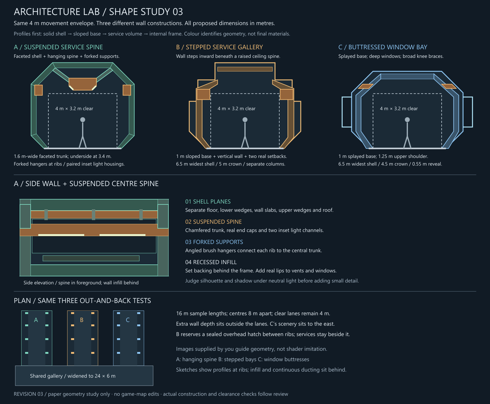

# Architecture lab — shape study 03

2026-09-21. Revised paper proposal following the user's three geometry references and request to distinguish A from C. Revision 03 adds A's suspended service spine; B/C and route spacing remain revision 02. No game geometry changed.

## What changed

The user rejected variations based primarily on height and fittings. The new vocabulary starts with the enclosing geometry: lower chamfer, vertical wall, upper shoulder and ceiling form a faceted section; ribs follow that section; separate ducts sit in its service shoulders; internal pillars and beams give the bays depth. These shapes must read under neutral lighting with simple materials.

The three supplied references are preserved in `references/architecture-lab/`: [TrenchBroom sample](references/architecture-lab/01-trenchbroom.png), [chamfered tunnel](references/architecture-lab/02-chamfered-tunnel.png), and [window gallery](references/architecture-lab/03-window-gallery.png). Tool provenance is as described by the user; dimensions below are proposed Red Breach dimensions, not measurements of those images.

## Reading the sections

Solid outlines describe the inside face of the continuous shell. Filled frame pieces show ribs at a structural station; the shell recedes behind them between stations. Orange volumes are longitudinal ducts. Pale side outlines in C show window reveals between ribs, superimposed for explanation. Dashed rectangles reserve 4 m width and 3.2 m height, measured after all geometry. The scale figure is schematic. Colours explain construction, not proposed surface assignments.

A and C retain eight-sided shells, but A now has a suspended longitudinal centre spine with forked hangers, producing two open upper side channels. C keeps its open centre, deep knee braces and window bays. B uses a stepped section rather than an octagonal one.

### Revision 03: A's ceiling centrepiece

Add a 1.6 m-wide chamfered service trunk centred above the walking lane. Its cross-section vertices are (-0.8,4.1), (0.8,4.1), (0.8,3.65), (0.55,3.4), (-0.55,3.4), (-0.8,3.65), in local horizontal/height metres. The underside is 3.4 m high, leaving 0.2 m above the protected 3.2 m clearance. Two light housings inset into the lower diagonal faces follow the trunk; their outer edges must remain above 3.4 m. Their recesses and borders are real geometry, with emissive inserts later.

At each rib, paired angled hangers connect the upper shoulders to the trunk. This creates a repeated forked shape and visible space above/beside the service volume. Use separate convex wedges and rectangular brackets, with joints meeting the rib and trunk faces. The section drawing shows the joined silhouette, not an instruction to leave overlapping faces.

Run the trunk from Z = -1 to -15, with chamfered end caps visible from both approaches. Support its ends at those positions, plus the intermediate ribs at -4, -8 and -12. End hangers connect to the overhead shell through short mounting blocks; intermediate hangers connect directly to ribs. Break light inserts at supports so the ceiling reads as a sequence of constructed bays. The side ducts remain secondary and feed the centrepiece at one end through a visible overhead cross-connection. No centre posts or floor obstacles.

Judge the dropped faceted mass, forked supports, dark upper voids and paired light channels in plain greybox first. The geometric silhouette must establish the difference from C before lighting colour or textures do any work.

## Profiles and brush pieces

All coordinates below are local (horizontal distance from corridor centre, height), in metres. Mirror the left-side chain to form the right. The floor joins the bottom points; the roof joins the top points. These are exposed interior planes; allow 0.25 m shell thickness beyond them, increased locally for window reveals and frame joints.

| Profile | Left interior chain from floor to crown | Construction |
|---|---|---|
| A: faceted pressure tunnel | (-2.25,0), (-3,0.75), (-3,3.75), (-1.75,5) | Lower wedge, vertical slab, upper wedge, flat roof. Internal rib follows all planes, with about 0.3 m relief. Duct sits in upper wall zone outside the clear lane. |
| B: stepped service gallery | (-2.25,0), (-3.25,1), (-3.25,2.75), (-2.75,2.75), (-2.75,4), (-1.75,4), (-1.75,5) | Sloped plinth, vertical backing, shoulder ledge, upper service wall, second ledge and raised ceiling spine. Separate columns and knee brackets stand forward of the backing. |
| C: buttressed window bay | (-2.25,0), (-3.25,1), (-3.25,3.25), (-2,4.5) | Broad sloped base, vertical window wall, diagonal shoulder, flat roof. Internal columns turn into diagonal braces and a spanning beam. |

Build each rib assembly from separate convex solids: base wedge, upright, diagonal knee and crossbeam. Do not extrude an entire concave frame as one brush. Miter or butt adjoining pieces without coplanar overlapping faces. Ducting is separate brush geometry; brackets interrupt its silhouette at deliberate support points. Fit duct segments between rib stations with enclosed sleeves through the frames rather than unresolved intersections.

C's windows are 2.5 m along the corridor, sill 1.25 m, head 3 m, with 0.55 m reveals. The outside glazing plane is 3.8 m from corridor centre. Windows appear only on the east exterior side; west bays use recessed solid panels. Place piers at rib stations and join a physical base and roof cap to them. The first test omits rails so they do not disguise the base/pillar silhouettes; the glazing stays sealed.

## Revised top-down arrangement

Retain three 16 m out-and-back samples, with all floors at Y = 0. Widen the transverse comparison gallery to 24 x 6 m because the shapes now have genuine depth. It is a circulation gallery, not a room: its 4:1 proportion is intentional.

Godot coordinates: north = negative Z. Gallery clear bounds X = -12 to 12, Z = 0 to 6, height 4 m. Corridor centres X = -8, 0, 8; each runs Z = -16 to 0. Protected lanes: A X = -10 to -6; B X = -2 to 2; C X = 6 to 10. Shell extents and window reveals sit outside these lanes. With 0.25 m wall backing allowance, adjacent corridor shells remain separated. C glazing reaches X = 11.8; scenery starts east of X = 12.5.

Each opening is 4 m wide x 3.2 m high with a level threshold. Frame centres along travel: Z = -0.25, -4, -8, -12, -15.75. Frames are 0.35 m deep along travel; end frames remain within the sample. Transition from each rectangular gallery portal to its full shaped section within the first metre. End walls are sealed, with a service termination in B and quiet faceted infill in A/C. Spawn at (0,0,3), facing the samples.

No keys, locked gates, objectives, enemies or pickups. The three routes are freely reversible. Check sprint turns and retreat in the gallery. Compare both views down each sample. Doors, room examples and playable exterior remain later experiments.

## Hatch reservation

B reserves a sealed 2.5 x 2.5 m ceiling hatch centred at X = 0, Z = -10, Y = 5, between ribs. Backing reservation X = -1.5 to 1.5, Z = -11.5 to -8.5, Y = 5.5 to 7.5. Reserve a 3.5 x 3.5 m landing below, kept empty. Central ceiling services and lights must stop before this bay or route beside it. The side ducts remain outside the pocket. This reserves space only; actual enclosure, roof cut, navigation and bug fit need validation before any hatch behaviour.

## Material and workflow requirements

Use supplied metric Kenney materials, 32 map units per metre, and 0.03125 face scales. Sloped faces need unit tangent UVs. Continuous flat floors remain Dark/texture_06. Every material transition has a physical seam, border or change of plane. Large base chamfers and shoulders are intentional silhouette features, not tiny mesh bevels.

Proposed source remains `RedBreach/maps/architecture_lab_01.map`; proposed saved scene `RedBreach/architecture/architecture_lab.tscn`. This proposal does not create either. Keep the mission launch unchanged. The user's plan-before-build rule applies to review of these revised profiles. On approval, build the primary shell and frames first; verify silhouettes, collision and rebuild persistence before adding equipment. Reusable equipment and lights remain authored outside generated Geometry.

Laptop validation executable: `C:\Godot\Godot_v4.7.2-stable_win64_console.exe`. Keep both existing addons and map format. Validate every entrance in both directions, minimum clear envelope after fixtures, neutral-light player-eye views, sealed windows/ends, hatch backing and performance. No commit or application-version increment requested.
