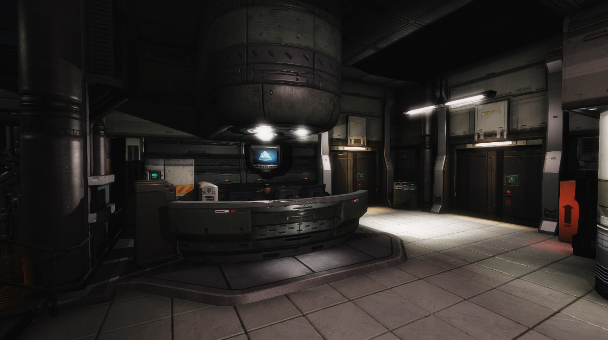
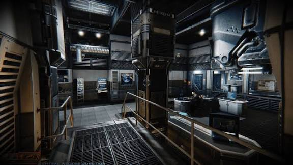
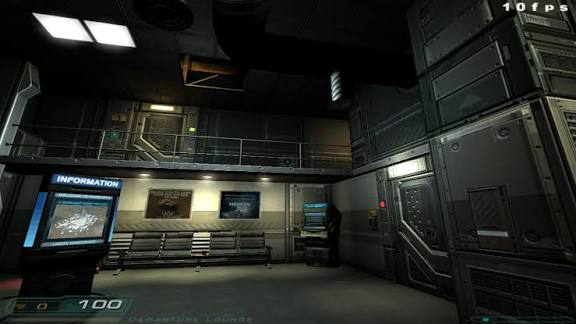

# Architecture study 01 — Doom 3, BFG and QUOD

2026-09-21. First reference selection for discussion, not an approved rebrush specification. No mission geometry changed. Observations below are visual interpretations; proposed dimensions are Red Breach experiments, not measurements of reference games.

## Proposed direction

Combine QUOD's broad, readable shapes with Doom 3's depth and integration of equipment into architecture. Develop three related families: quieter personnel corridors, exposed plant/service corridors, and substantial exterior shells. A player should recognize the family in greybox before materials and small details are added.

Our current Route A already has structural bays, corner profiles and service props. The next improvement should give those elements a clearer hierarchy and purpose. A corridor can have an enclosing shell, a repeated structural frame, inset services and occasional destination landmarks. Avoid making every bay equally busy.

## Reference board

### D01 — Administration / reception composition

Source: user's earlier Doom 3 BFG Administration reference, retained locally. Exact capture settings/mod status were not recorded; use for composition rather than edition comparison.

**Observe:** the counter and large overhead assembly share a centre; substantial uprights separate recessed wall fields; a bright door bay creates a second focus. Detail follows the larger composition.

**Translate:** pair an important workstation with a ceiling/service feature; set wall equipment inside a deliberate bay. Preserve our continuous dark floor. This is not a proposal to restore the removed Registration recess.

### D02 — Work area / occupied section

**Observe:** a large vertical equipment/structural mass organizes the room, with a guarded walkway and workstations around it. The overhead zone has a visible use.

**Translate:** reserve one major service spine or equipment mass as the room's organizing feature. Draw its relationship to the circulation and ceiling in section before adding smaller cabinets.

### D03 — Return view

Retained context for the user's established upper-return principle; this image was not re-analysed in this pass. See FR-005 in [Future Refinements](future-refinements.md). A new upper route requires its own spatial review and gate-bypass check.

### B01 — BFG / The Lost Mission / Coolant Transfer

[Source: Gamersyde Xbox 360 Lost Mission capture](https://www.gamersyde.com/video_doom_3_bfg_edition_lost_mission_360_-28887_en.html). Image visually inspected in browser.

**Observe:** large pipes on plinths flank a short stair; rails separate the path from machinery; the lit door closes the composition. Large shapes establish function before surface detail.

**Translate:** a service corridor should reveal what it carries. Put large equipment beyond the clear movement envelope and make supports/connections legible. Do not copy this apparent narrowness into our bug combat routes or introduce an unnecessary stair.

### Q01 — QUOD / broad room surfaces

[Source: Daivuk's official QUOD page](https://daivuk.itch.io/quod). Its three gallery images were visually inspected in browser; exact level names are not supplied.

**Observe:** broad wall fields, an upper horizontal band, a prominent door and limited colour groups make the room easy to parse.

**Translate:** preserve substantial quiet wall areas between structural elements. Use physical trims/recesses to support changes of material in Red Breach, even where a reference uses texture alone.

### Q02 — QUOD / service channel

**Observe:** a large horizontal pipe run, orange framing, ceiling services and a central channel establish a strong directional composition.

**Translate:** try an asymmetric service wall opposite a quieter wall. Keep the floor level and clear in the first test; a central trench would be a separate movement decision.

### Q03 — QUOD / descent and vertical enclosure

**Observe:** tall enclosing panels and a distant warm vertical feature emphasize the descent and depth.

**Translate:** give stair destinations a strong architectural marker while preserving our requirement to see the receiving floor before descending. A screenshot alone does not establish safe landing dimensions.

### E01 / E02 — exterior candidates, close inspection pending

- [Doom 3 exterior screenshot in TechRaptor's article](https://techraptor.net/gaming/features/doom-3s-inner-demons-conflicted-design).
- [Mars City gallery, including Monorail Ride](https://doomwiki.org/wiki/Mars_City_%28Location%29).

Search located these candidates, but direct image inspection encountered site verification pages. Do not treat their search captions as verified architectural evidence. The Mars City gallery also includes alpha imagery: label development-era references separately from shipped levels.

Exterior study questions: how does the building meet rock/ground; how deep are window and airlock reveals; where do large services enter the shell; what changes at parapets and corners; what gives the plant a recognizable distant silhouette? Initial Red Breach proposal: heavy base, broad panel fields, projecting frame/buttress, deep opening, roof/service silhouette. This is a design hypothesis pending reference review.

## Vocabulary to test

| Element | Intended feeling / role | Brush or prop treatment |
|---|---|---|
| Personnel bay | Sheltered, maintained, human scale | Straight lower wall, shallow inset panel, restrained upper corner, integrated light |
| Plant bay | Heavy, functional, exposed | Deeper service recess, substantial frame, one dominant service run, visible supports |
| Bulkhead threshold | Crossing into a distinct compartment | Deep jamb/header and wall returns; preserve tested aperture and level floor |
| Service spine | Explains what the space does | Large trunk connects equipment, ceiling and wall; branch only where useful |
| Quiet wall field | Lets structure and destinations stand out | Broad uninterrupted surface bounded by actual geometry |
| Junction landmark | Helps a player remember a turn | Terminal, distinct frame or equipment feature outside turning/retreat space |
| Exterior shell | A protected interior in a hostile landscape | Base, frames, recessed infill, deep openings and roof silhouette |

Suggested test increments at our existing 32 map units/metre: 0.125 m = 4 units, 0.25 m = 8, 0.5 m = 16. Compare shallow versus deep wall relief using these increments. These are construction increments, not approved intrusions into a route. Measure clear width after ribs, cabinets and trims, not at the wall backing.

## Applying the study to freight

1. Choose the corridor family from this board. First candidate: an existing Route A connection approaching Inspection, with its present doors, route and floor elevations fixed.
2. Record its current player-eye view and dimensions. Draw a top-down detail and cross-section showing clear movement width, frame depth, service recess, lowest overhead point, hatch backing and adjacent occupied volumes.
3. Compare two paper profiles: **personnel** (quieter, shallow relief) and **plant** (asymmetric service recess, deeper frame). Add an exterior elevation study separately once exterior references are inspected.
4. Rebrush a short reviewed sample using the existing source map workflow. Shells, recesses, major ribs and doorway depth belong in TrenchBroom; repeatable equipment/light assemblies remain external Godot scenes. Preserve the route, keys, gates and hatch reservations.
5. Inspect the result first under neutral light with the metric greybox materials, then with intended lighting. Check both directions, sprint turns, backing away, door approaches and stair views. Compare rendering cost with the current sample.
6. After the sample feels right, map these families onto the mission plan and extend them by zone. Keep accepted Registration/Screening as comparison anchors; wider revisions should be deliberate.

Use the normal freight rebuild and its combined validation after construction. Never regenerate the mission from historical authoring helpers. No new addon, map format, asset pack or game version is needed for this study.

## Edition and evidence notes

[The publisher's Steam listing](https://store.steampowered.com/app/208200/Doom_3_BFG_Edition/) identifies original Doom 3 and BFG as distinct included versions, with rendering/lighting changes and The Lost Mission in BFG. This board does not establish an original-versus-BFG architectural comparison: that needs matched locations, viewpoint, FOV and known capture settings. Avoid using remaster/mod lighting differences as evidence of different geometry.

Remote reference images remain linked to their hosts and require connectivity. Original images remain their creators' work; they are study references, not Red Breach assets. The local Administration references were already supplied by the user.
