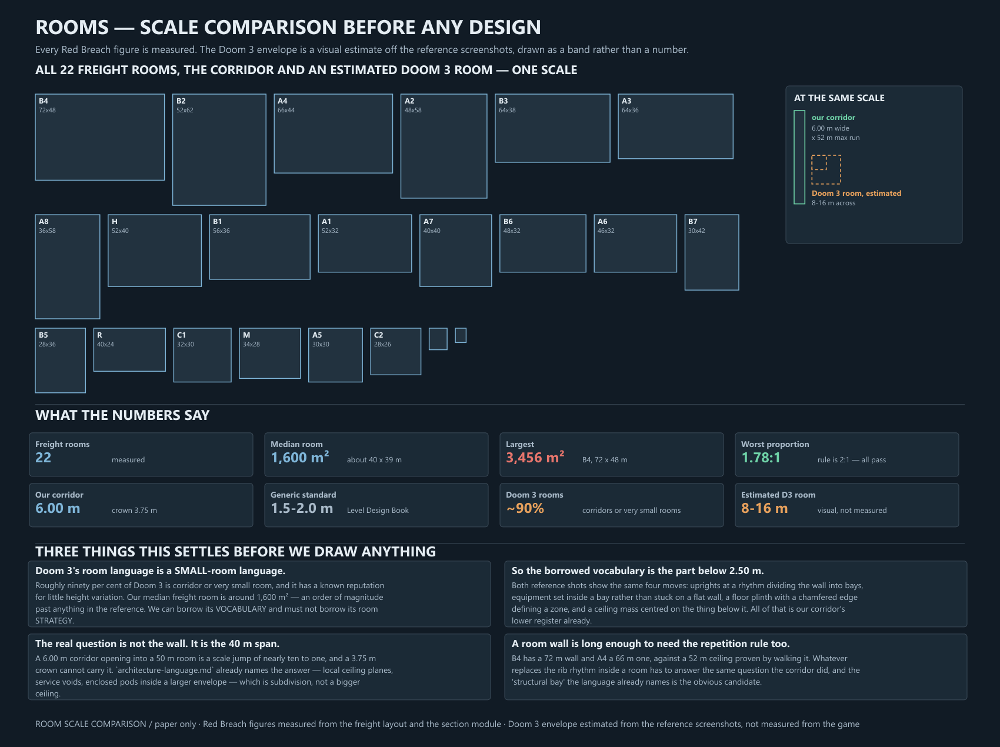

# Architecture study 02 — rooms

2026-09-22. Reference research before any room design work, at the user's
direction: look at Doom 3 rooms first, compare them with what we are actually
trying to build, then go to paper.

No geometry changed. Red Breach figures here are **measured**; Doom 3 figures
are **visual interpretations of reference screenshots**, never measurements of
the game.

## The finding that reframes the whole thing

**Doom 3's room language is a small-room language, and we do not have small
rooms.**

Discussion of Doom 3's level design consistently reports that roughly ninety per
cent of the game is corridor or *very small room*, with a known reputation for
little height variation. Reading the two Administration reference shots against
their door and human figures puts a typical room somewhere around **8–16 m**
across — deliberately a band, because it is an estimate.

Our freight rooms, measured:

| | |
|---|---|
| Rooms | 22 |
| Median | **1,600 m²** — about 40 × 39 m |
| Largest | **3,456 m²** — B4 Generator Hall, 72 × 48 m |
| Smallest real room | 728 m² — C2 Valve Service, 28 × 26 m |
| Worst proportion | **1.78:1** — the rule is 2:1, so every room passes |

That is an order of magnitude past anything in the reference. So the conclusion
is not "copy Doom 3 rooms":

> **Borrow Doom 3's vocabulary. Do not borrow its room strategy.**

Its strategy for a large space is to not have one. Ours cannot be, because the
rooms are already drawn, already proportioned correctly, and already carry the
mission's function.

## The vocabulary worth borrowing

Both reference shots show the same four moves, and all four are things our
corridor section already does below 2.50 m:

| Move | Already in our section |
|---|---|
| **Uprights at a rhythm** dividing the wall into bays | the rib, at 4 m pitch |
| **Equipment set inside a bay**, not stuck on a flat wall | the W2/W3 panel swap-outs |
| **A floor plinth with a chamfered edge** defining a zone | the base kick and plinth |
| **A ceiling mass centred on the thing below it** | nothing yet — corridor-specific |

The first three transfer directly. That is the lab plan's untested claim —
*"the plinth and panel registers below 2.50 m are what should carry into
rooms"* — and the references support it.

The fourth is new and is the interesting one: in both shots the ceiling is
**low and worked**, not high and empty, and its mass is deliberately centred on
the counter or the equipment below. Height is not how those rooms get presence.

## What this leaves as the actual problem

Three things, none of which the reference answers for us:

**1. The 40 m span.** A 6.00 m corridor opening into a 50 m room is a scale jump
of nearly ten to one, and a 3.75 m crown cannot carry it.
`architecture-language.md` already names the answer — *local ceiling planes,
service voids, enclosed office pods inside a larger envelope* — which is
**subdivision, not a bigger ceiling**. The reference agrees: its rooms get
presence from worked ceilings and equipment masses, not from height.

**2. A room wall is long enough to need the repetition rule.** B4 has a 72 m
wall and A4 a 66 m one, against the 52 m ceiling the user established by walking
it. Whatever replaces the rib rhythm inside a room has to answer the same
question the corridor did, and the **structural bay** the language already names
is the obvious candidate.

**3. The threshold.** A room opening is a bigger T jamb, and the T taught us
that a square-cut jamb leaves a real void wherever the profile is inboard of its
widest. A room opening will do the same, at a larger size.

## Sources

- The two Administration screenshots in `docs/references/doom3-administration/`,
  user-supplied and already analysed for corridors in
  [study 01](architecture-reference-study-01.md).
- [Doomworld — "Is Doom 3's level design bad?"](https://www.doomworld.com/forum/topic/107426-is-doom-3s-level-design-bad/)
  and [id Tech 4 ModWiki](https://modwiki.dhewm3.org/Mapping), via search
  summaries; the Doomworld threads themselves are behind a bot check and were
  not read directly.
- [The Level Design Book — blockout metrics](https://book.leveldesignbook.com/process/blockout/metrics),
  for the generic corridor/ceiling/door figures our 6.00 m corridor is compared
  against.
- `docs/freight-blockout-layout.json` and `tools/architecture_lab_section.py`
  for every Red Breach number, read by `tools/draw-room-scale-comparison.py`.

## Next

Paper design, now with the scale problem named rather than assumed: a room, the
corridor-to-room threshold, and the exit into a second room. The open question
for the user is whether the first room studied is a **small one** (C2, 28 × 26 m
— the easy case, tests whether the register carries) or a **hall** (B4-like,
where subdivision has to do real work).
