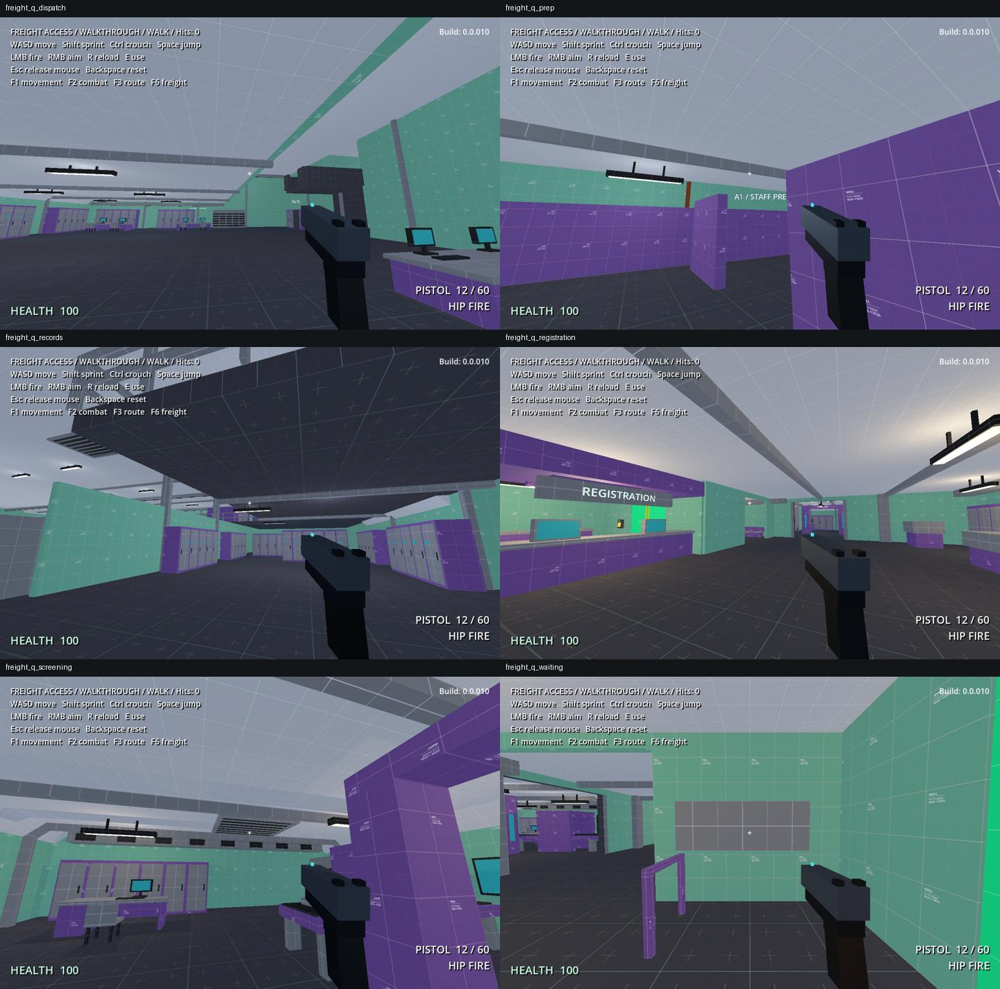

# Route A quality pass / layout 12

The unattended quality pass is complete. Application version remains **0.0.010**. Everything remains local and uncommitted, ready for a human walkthrough.

## Corrections

- **Earlier Registration/Screening:** moved the buried noticeboard onto the waiting-area wall; split the staff duct around its partition; moved the north service trunk clear of uprights; added a sealed Screening C1 ceiling hatch placeholder.
- **Ceilings and services:** removed overlapping Dispatch office slabs and redundant Prep beams. Split ducts at the Dispatch height change and Watch partition. Moved light housings away from walls, beams and a mezzanine edge. Conflicting trim finishes now have physical separation or butt joints.
- **Light mounting:** 350 simple physical stems connect suspended housings to real overhead surfaces. These remain editable cuboids.
- **Office access:** eleven extra side-aisle walks were tested in both directions. A cabinet bank blocked the lower Clearance office crossover; removing it restored access while retaining the surrounding desks/storage.
- **Hatch reservations:** all nine retain sealed roofs, 2.5 m apertures, 3.5 m landing squares and checked emergence paths. Each has a 3 x 3 x 2 m clear overhead reservation for current small/regular melee bugs. These are reserved spaces; enclosure, roof cuts, actual grate behavior, navigation and spawning remain future work. A large-body exit check does not establish that a spitter fits the staging pocket.

The accepted main route, stairs, elevations, keys, gates and Maintenance choice remain. All non-RouteA source brush records match the quality-pass checkpoint, including B, hub and arrival/lift architecture. The earlier-room prop corrections are within the user's additional authorization.

## Rendering

Editable cuboids now combine by material within each prop **during play only**. The source scenes retain their cuboids; collision and lights are unchanged. The generated rendering nodes are not saved. This reduces submission overhead while the blockout remains easy to edit.

| Fixed view | Draw calls before | Draw calls after | Median frame time before / after |
|---|---:|---:|---:|
| Registration | 1,905 | 1,008 | 1.79 / 1.22 ms |
| Administration | 1,825 | 450 | 1.70 / 0.97 ms |
| Inspection | 3,922 | 827 | 3.16 / 1.20 ms |
| Records | 3,723 | 1,167 | 3.42 / 1.52 ms |
| Dispatch | 1,425 | 366 | 1.57 / 0.92 ms |
| Watch | 4,676 | 1,119 | 4.38 / 1.42 ms |
| Clearance | 814 | 354 | 1.29 / 0.90 ms |
| Annex | 2,609 | 1,271 | 2.20 / 1.38 ms |

This is a single local comparison on the RTX 2080 SUPER, Godot 4.7.2 D3D12 Forward+, with an empty mission and eight fixed views. The offscreen window was 1440 x 900, vsync disabled, 75 warmup frames and 240 measured frames per view. It establishes a rendering improvement, **not populated-game FPS or human playtest performance**. [Raw comparison and batch checks](freight-route-a-performance.json).

For authoring, a unique prop geometry variant should use its own prop scene: the runtime cache is shared per scene. Props containing non-cuboid visual meshes are skipped, ready for later Blender replacements. `--no-visual-batch` provides an A/B diagnostic. Startup cost and populated combat performance remain separate profiling questions.

## Validation

- **217 freight + 61 Route A + nine shared texture checks passed.** This covers progression/reset, all 19 stair flights, forward/reverse routes, authored interactions, furnished side aisles and hatch reservations.
- **634 runtime assembly comparisons passed:** matching bounds, triangle totals and material totals; 507 collision bodies and 164 lights unchanged; source visuals remain saved/editable; generated batches remain unsaved. All 350 light mounts meet actual overhead geometry.
- **2,176 source brush collisions / 24,356 baked triangles** reload with measured one-metre Kenney UV repeats.
- The saved cuboid/brush audit reports zero prop/architecture penetrations, zero cross-assembly prop intersections and zero exposed coplanar pairs with differing finishes. It retains 645 same-material/same-UV structural join pairs. The audit uses a 4 mm penetration tolerance and sampled axial faces; it supplements rendered inspection, not a guarantee against every visual artifact.
- Inspected **29 refreshed route views plus six focused quality views**. [Validation record](freight-route-a-validation.json).

Normal edits use `tools/rebuild-freight-blockout.ps1 -Validate`, now including the runtime batch comparison. The one-time apply/repair helpers are historical and must not overwrite later edits. Geometry is still authored in the source map; placement scenes remain editable.

## Tomorrow's walkthrough

Use the [eight-stop walkthrough](freight-route-a-walkthrough.md). Take the ordinary Watch/Clearance return first, then try Maintenance separately.

1. Do Inspection and Dispatch have enough recognizable local landmarks, or do their repeated equipment groups still make them feel too broad?
2. Are Records, Watch and Clearance's lower floors visible early enough when approaching the descending stairs? Automated traversal cannot settle that feeling.
3. Do the newly checked side aisles feel useful for exploring and retreating? In Clearance, try the crossover between both lower offices.
4. Are the sealed hatch positions readable enough to support an ambush tell later without dominating every room?

I left room subdivision, encounter placement, major landmarks and lighting mood for that review. The mission is still an empty blockout; this pass does not establish combat difficulty or the ten-minute target.
