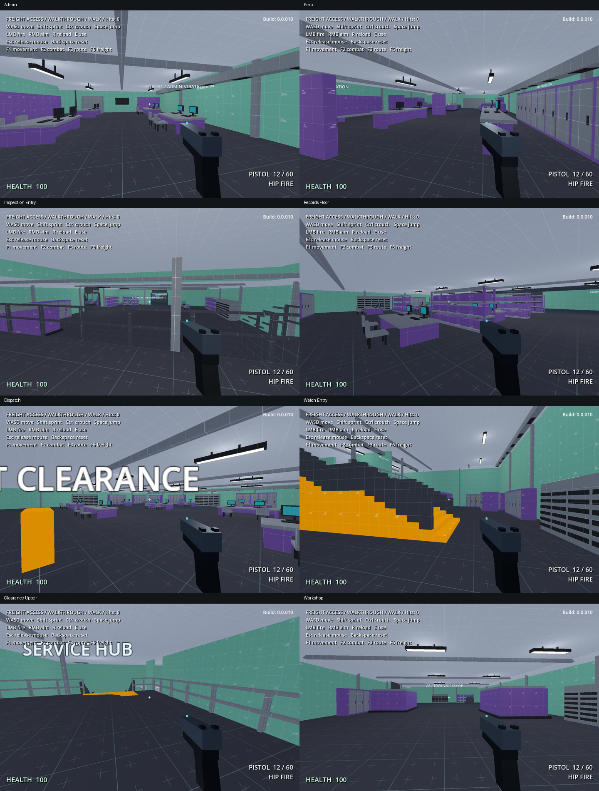

# Route A / furnished walkthrough 12

All of Route A is ready for a new empty walkthrough. This pass follows the user's explicit waiver of another paper review and continues the Registration/Screening language across the rest of admin. Application version remains **0.0.010**; this work is uncommitted.

The [quality-pass notes](freight-route-a-quality-pass.md) cover earlier-room corrections, the cleared lower-office crossover, physical light mounts and measured rendering improvements.

## Start here

Save any open editor work and reload the freight scene, then press **F5**; **F6** returns to freight from the gyms. **Backspace** resets the walkthrough. Use **E** at the existing cards, readers and selector. Take the ordinary A5/A6 return on the first pass so the Maintenance shortcut does not hide the last two rooms.

This is still an empty architecture walk. There are no new enemies, rewards, automatic doors or hatch triggers. Keep the timer/distance readout for comparison, but do not treat this as a populated ten-minute mission test.

## Walkthrough stops

| Stop | What changed / where to look | What to judge on the ground |
|---|---|---|
| **1. A1 Administration** | Take the optional office opening off Screening. Paired computer desks, chairs, filing/storage banks, cooling and a framed service ceiling now fill the work bays. | Does the office read as a working department? Are the two work aisles comfortably navigable? |
| **2. A1 Staff Preparation** | Continue through Screening into the kit counters, repair bench, locker and cleaning bays. The floor stays level and dark. The larger closed grate reserves a future bug entry beside the route. | Is the Inspection exit readable without following a coloured floor strip? Does the room feel usefully occupied? |
| **3. A2 Inspection** | Stop on the arrival platform before descending. The open guard reveals the working floor; equipment is kept out of the tested downward sightline. Visit the pump-test room, staff room, circuit control and kit store. | Can you read the lower floor before committing to the stair? Do the machines and workstations establish different room functions? |
| **4. A8 Inspection Annex** | Take the side branch into intake, the long tool workshop, service stores and spare assemblies. Doorways retain their full reviewed widths. | Is the optional branch interesting enough to explore? Is the workshop's long axis justified by its equipment and service aisles? |
| **5. A3 Records / A7 card branch** | Continue past the fixed door detour into Records. Low office canopies sit beside the taller stair/gallery volume. Go upstairs for the Records card, then return and look back through the open rails. A7 has a lower archive ceiling and retrieval stations. | Does the change in height help you understand the route? Are the downstairs work area, upper gallery and card branch distinct enough to remember? |
| **6. A4 Security Dispatch** | Use the Records card at door 2, enter Dispatch and collect freight clearance at the existing route split. Dispatch is a staffed operations area; the Maintenance ladder retains a taller service volume. | Is the choice between the Maintenance shortcut and the ordinary Watch route legible? Does Dispatch need a stronger central landmark? |
| **7. A5 Watch Gallery** | Take the ordinary route into surveillance equipment, then climb to the Watch consoles. Open rails preserve views into the room. An east-side hatch reservation has a clear emergence route. | Does the upper route feel purposeful? Check the turn at the top and the visibility of the Clearance exit. |
| **8. A6 Clearance / return** | Enter the supervisor overlook and descend past the lower office pods. Upper-edge furniture was removed where it obscured the descent. Release S1 from this side and return to the hub. | Can you see where the descent leads? Are the lower offices inviting to investigate, and is the hub return obvious? |

The long corridors now use structural bays, visible light housings and alternating service equipment. While moving between stops, note any stretch that still feels like a featureless tunnel. Their length and bends remain intentional; a later encounter/landmark pass can vary the rhythm.

## My main walkthrough questions

1. **Density:** which specific bay still feels empty, and which is already busy enough? The larger Inspection and Dispatch rooms are the main places to judge this.
2. **Vertical readability:** do the open gallery rails and lower office ceilings make the stairs, overlooks and return route easier to understand?
3. **Combat space:** while backing away and turning, do the clear lanes feel generous enough without making the equipment irrelevant? Actual combat tuning follows the encounter pass.

## Construction record

- Complete scope: A1's remaining Administration/Staff Preparation, A2, A8, A3, A7, A4, A5, A6 and Route A corridor connections.
- Accepted Registration and Screening assemblies, the exterior view, original route/elevations/objectives, B, hub, arrival/lift and Maintenance destination remain in place.
- 623 placed prop assemblies reuse 91 cuboid assets, with 11 separate fixture-mount assemblies: desks, visual-only chairs, shelves/cases, storage, server banks, air handling, pumps, work equipment, ducts, lights and closed grates. Architecture includes ribs, upper corner profiles, office canopies and open gallery rails. Forty-eight corridor bays break up the long connections.
- Palette: continuous dark floors, muted-green walls, pale ceilings, purple equipment, grey services and physical framing at changes. Kenney repeats remain one metre. No painted walkway replaces the removed recess.
- Nine closed ceiling hatch placeholders reserve 2.5 m apertures and 3.5 m landing squares. Physics checks cover a 2 m wide body leaving each landing for the walking route. A 3 x 3 x 2 m backing volume is checked above each sealed roof for small/regular melee bugs. No roof cut, enclosed staging chamber, grate animation, navigation bake or spawn trigger has been added; the service pockets still need construction during the encounter pass.
- Office ceilings are lowered locally where the route allows it; taller volumes remain around occupied upper floors, stairs and the Maintenance ladder. The original stair flights and movement tuning are unchanged.

## Editing and validation

Edit architecture in `RedBreach/maps/freight_01.map`. Props are ordinary editable external scene instances under `RouteAStyle` in `RedBreach/missions/freight/freight_blockout.tscn`, placed by `RedBreach/missions/freight/route_a_furnishing.tscn`. Reusable assets live in `RedBreach/props/blockout/route_a/`. Replace their visual cuboids with later Blender assets while preserving metres, placement and useful collision. During play, a temporary rendering cache combines eligible cuboids by material within each prop. Editor/source cuboids, collision and lights remain editable; non-cuboid replacement visuals are skipped. The cache assumes instances of the same prop scene share their source Visual geometry: make a separate prop scene for an instance-specific geometry variant.

The [placement record](freight-route-a-style.json) contains room bounds, local canopies, individual prop footprints and hatch reservations/emergence routes. The source map remains authoritative; never rerun the historical apply/finish scripts over later TrenchBroom edits. The normal rebuild only rebuilds the map and preserves authored siblings.

`tools/rebuild-freight-blockout.ps1 -Validate` passes **217 freight checks + 61 Route A checks**. The shared metric-texture validation passes **nine checks**. All **2,176 brush collisions** reload; **24,356 baked triangles** retain the correct UV scale. Full traversal, reverse A, all 19 stair flights, doors/cards/selector/ladder, reset, prop support, work aisles and hatch clearance pass. Thirty-five final player-eye views were inspected. Runtime batching also passed 634 assembly comparisons and all 350 fixture-mount support checks. See [validation evidence](freight-route-a-validation.json).

Human navigation, perceived density, frame rate on a real run and encounter quality remain walkthrough questions; automated traversal is not human pacing evidence.
