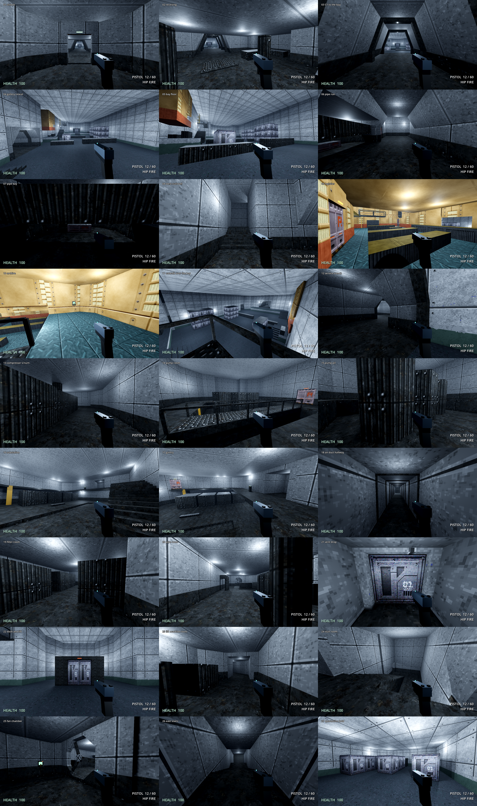

# Freight access v2: G-01 greybox (stage 3, whole level first)

Status: **G-01 built and validated**, 2026-09-26, from plan revision 08
([freight-v2-plan.md](freight-v2-plan.md)). The user chose to build the whole
level before the room studies, on the condition that a single room can be
adjusted without rebuilding everything (see "Editing one room").

It is the project's main scene, so **F5** in the editor starts it, and **F11** opens it from any gym or lab.
- A timer starts when you first move, and stops at the lift gate, so the
  empty walk can be measured. It is not on screen: a notice shows the time and
  distance at the lift, and every playtest note and the logged finish carry them.
- The HUD shows only the non-standard keys (**Q** note, **Z** z-fight) upper
  left and the build upper right; the rest is a normal WASD setup.
- **P** switches presentation (off / subtle).
- **Backspace** returns you to the airlock and resets the timer.
- **E** climbs a ladder, up from the bottom or down from the top.
- **Q** leaves a playtest note at the crosshair; **Z** marks z-fighting. See [playtest-notes.md](playtest-notes.md).

## Files and commands

| File | Role |
|---|---|
| `tools/freight_v2.py` | The plan: the single source of truth, including the 3D build data at its end (ceilings, blocker heights, door sizes, ladder facings, lighting, capture views). |
| `tools/bootstrap-freight-v2.py` | **One-time** generator of `RedBreach/maps/freight_v2_01.map`. It refuses to overwrite; `--overwrite` regenerates everything; `--room KEY` regenerates one room in place. Never part of a rebuild. |
| `tools/polykit.py` | 2D polygon kit: convex decomposition and convex subtraction (walls with openings, floors with pits). |
| `tools/check-map-zfight.py` | Leaks and visible z-fighting in the map as edited; part of `-Validate`. See [playtest-notes.md](playtest-notes.md). |
| `RedBreach/maps/freight_v2_01.map` | **The editable source** (TrenchBroom) once generated. |
| `tools/write-freight-v2-scene.py` | Writes the scene shell: environment, navigation node, level script, player with its climb chart, capture views. Rewriting it clears the built geometry, so rebuild after it. |
| `tools/rebuild-freight-v2.ps1 -Validate` | Import, build, bake navigation, then run the marker validator. |
| `RedBreach/tools/build_freight_v2.gd` | Builds the map, bakes navigation and keeps only the navigation reachable from the route markers (the bake also finds the tops of ceilings). |
| `RedBreach/tools/capture_freight_v2.gd` | The 27-view sheet `docs/freight-v2-built.png` (run without `--headless`). |
| `RedBreach/mapping/fgd/rb_light.*`, `rb_ladder.*` | New map entities: an omni light, and a climbable ladder that uses the freight player's ClimbChart. |

**Expected counts on any machine** (after `--import`), since the z-fighting pass:
- `LEAK: none, the level is sealed`
- `ZFIGHT: ... 0 VISIBLE, 0.0 m2`
- `FREIGHT_V2_BUILD: 1606 brushes; 181 lights; 7 ladders; 30 kit pieces; 664 navigation polygons; save=0`
- `MARKER_QA: 830 checks; 0 failures`

The playtests changed the wall, plinth, frame and container rules: see [freight-v2-playtest-01.md](freight-v2-playtest-01.md) and [freight-v2-playtest-02.md](freight-v2-playtest-02.md).

## What G-01 is

A walkable empty greybox of the whole plan, in the settled style: looks per
room, P1/P2 trapezoid corridors with ribs on the 4 m beat, and the light
floor.
- **Rooms:** floors, with pits, lanes and shafts cut out.
- **Walls:** exterior walls stand outward. A wall shared by two rooms is one
  centred wall. Where a room sits stacked over another (the booth notch
  under Logistics), the lower room's wall stops under the upper floor.
- **Openings:** cut from the plan. Corridor mouths take the corridor's own
  profile (the junction rule). Doors and windows are sized by kind, and the
  explicit openings include the fan hole.
- **Ceilings:** per room, with a bulkhead where two heights meet (Logistics).
- **Levels and stairs:** solid platforms, thin decks (the gantry U, the
  archive, the stair room's top landing), stairs solid down to the floor,
  and the bridge with rails.
- **Blockers:** simple solids at plan heights. Risers turn into the walls,
  and the piston rises to the ceiling.
- **Corridors:** P1/P2 kit profiles; S3 service stairs; the D2 duct with
  tiny ribs every 2 m; the crawls; the catwalk, as a railed deck with walls
  only where it leaves a room.
- **Ladders:** five, as `rb_ladder` entities. E climbs them, and the climber
  snaps onto the ladder going up.
- **Lights:** 174 `rb_light` entities.
  - Room lights are placed by coverage: every walkable metre, including decks
    and the space under them, is lit in line of sight.
  - Measured: minimum 0.41, 10th percentile 0.80, median 1.41. The floor is
    0.35 and nothing is waived.
- **Route markers:** 502 across five routes, walked by the real player:
  - card first, vent return
  - power first, S2 return (both ways)
  - the east completionist
  - the knowing player by the catwalk
  - the catwalk explorer through the fan

  Routes with the vent drop are one way.

**Not in G-01** (the progression and detail passes):
- Doors are open holes, apart from the sealed airlock, roll door and lift.
- No switches, locks, the cage release or card logic.
- The fan is its stopped hole, with no blades.
- The catwalk section (3) is down.
- The secret interiors (the bridge girder crawl, the cable vault, the
  conveyor crawl) and the crane rail with its hanging container are not
  built.
- There are no rails on stairs and platform edges, and no props.

## Editing one room (the user's condition)

- **Every room is its own TrenchBroom group**, named by its plan key (for
  example `PR Pump Room`). Its floor, ceiling, levels, stairs, blockers,
  lights and ladder are all in that group.
- **Corridors** are their own groups (`W1 Pipe run`, and so on).
- **Walls:** a room's outer walls are `PR walls`. A wall shared by two rooms
  is its own group, `CU|PR walls`.
- **Hand edits are surgical.** Isolate a group in TrenchBroom, edit it and
  rebuild. func_godot rebuilds the whole map each time, but the map file is
  the source, so nothing outside the group changes.
- **Regenerating one room from the plan:** after changing a room in
  `freight_v2.py`, run:

  `python tools/bootstrap-freight-v2.py --room PR`

  It swaps only the groups starting with `PR` and the shared walls naming
  it, keeping every other group and its hand edits.
  - Tested: a hand edit in Receiving survived a Pump Room regeneration.
  - Brush, light and ladder counts were unchanged.
- **The one rule:** rooms only meet at their openings. As long as an
  opening keeps its position, size and floor height, no neighbour changes.
  Moving an opening is a two-room edit: the room, and the room or corridor
  on the other side.

## Findings from the build

- **Corridors can open off a side.** The pipe bay's mouth needed the pipe
  run's own side wall cut below the opening top, not only the room's wall.
- **Stacked floors need tags.** On a point with two floors (the gantry over
  the substation floor), a route point needs its tag, or it takes the floor
  below. Points exactly on a polygon edge are ambiguous.
- **Stairs below the floor.** A flight that descends below its room floor
  (the U-turn's far steps into the lane) needs the floor cut from under it.
  Otherwise a 0.25 m step becomes a 0.5 m ledge. Every flight is now solid
  down to the room floor.
- **Ladders:** a climber brushing the ladder panel failed the "can stand"
  check. Snapping onto the ladder spot going up fixes it, and matches how
  ladders usually work in games.
- **The fan octagon must enclose the circle.** Otherwise its flat bottom sits
  0.36 m up, over the 0.3 m step, instead of on the 0.25 m lip.
- **Validator changes:**
  - Players derived from the gym player are accepted.
  - A "climb" posture uses the nearest ladder.
  - `oneway` routes are walked forward only.
  - Shapes and meshes owned by scripted entities (ladders) are not counted as
    brushes.

## Z-fighting and leaks, pass 1

The user's first walk (189 s, 656 m) found many flickering surfaces. The new check
(`tools/check-map-zfight.py`) measured **1,122 visible z-fighting pairs (1,605 m²) and 35 leaks** into the void.
Each came from a generator rule, so each rule was fixed once, not each spot. The result is **1 pair (0.05 m²) and
no leaks**, with the routes, light floor and gym validation unchanged.

**Rules, now in `tools/bootstrap-freight-v2.py`:**

- **Walls sample the floor densely.** A wall's height range is sampled every 0.25 m. It never stops above the room's
  base floor, and reaches down into pits and channels along it. One sample on a stair or platform had lifted
  walls off the floor, leaving the biggest leaks.
- **A wall's top follows what overlaps its own footprint,** worked out 0.25 m at a time:
  - A room stacked across the edge caps the wall: the booth notch under Logistics.
  - A room beneath raises the wall to its roof: Logistics' east wall stands to the Sorting Bay's ceiling.
  - Short end runs merge into their neighbour where a corner's mitre cuts back further than the run is long.
- **Corners are mitred as one chain**, within a room and across rooms (the dock's north wall meeting the truck bay's
  east wall). Two walls meet on the corner's bisector instead of overlapping, which made every inside corner flicker.
- **Rooms exactly one wall apart share one wall**, filling the gap: pump room and filter room, secret closet and
  pipe bay.
- **The junction rule, built:** a corridor mouth cuts the room wall to the corridor's OUTER shell. The corridor's
  own pieces fill the wall's thickness up to the room face, so the portal frame is the corridor's profile.
  - At a **door**, the corridor's walls and ceiling stop at the wall's outer face.
  - A door-wide **threshold** slab runs under the door, and the door hole starts at the threshold's underside.
- **Side openings** (the pipe bay off the pipe run): the corridor's pieces are clipped at the room's edge, and the
  room's wall there is left to the corridor. A room wall lying inside a parallel corridor's shell is also left to
  the corridor.
- **Nothing lies on a floor.** Things stop where the surface above them starts:
  - pit, lane and channel walls stop at the surrounding floor's underside
  - blockers stand on the lowest floor under them
  - anything under a deck stops at the deck's underside (the supervisor cage under the archive)
  - bulkheads sit on the lower ceiling slab
  - ladder shafts stop under the floor they rise through
  - box corridors have a full-width ceiling over walls that start on the floor slab
- **Shared-wall doorways stand on the floors**, which meet under the wall. A door exactly as tall as the room beside
  it runs up through that ceiling slab and meets it flush (door 1 and the secret closet).
- **A crawl under a room** (the pipe gallery under the pump room) uses that room's floor as its ceiling.
- **Catwalks** are a deck with rails inside rooms and an enclosed box between them. The catwalk had been open above
  the dock.
- **`outside_intervals`** judges each step by its midpoint and finds the switch points by bisection. A point on a
  wall that two rooms share is never "outside", which had made a 0.1 m sliver of catwalk shell at the sorting bay's
  edge.

- **Platforms and ceilings stop at the face of a shared wall** (`shared_strips`): a centred wall stands a quarter
  metre into each room. A platform or ceiling running under it put its edge face on the plane of the wall's end,
  where they flicker: the S1 landing at the dock edge (the user's first Z mark) and the truck bay's ceiling lip.

Result: **0 visible pairs, sealed**, 1,014 brushes, and the routes and light floor unchanged.

## G-02: progression, and every room owning its walls

**Every room owns its walls** (the user's rule, 2026-09-22):
- A wall two rooms share is now two 0.25 m halves, each in its own room's look, from that room's floor to its ceiling.
- A wall in a 0.5 m gap is split the same way.
- Each half is in its room's `KEY walls` group, so `--room KEY` never touches a neighbour's half (tested: identical).
- Open edges (the bay, dock and truck bay risers and bulkheads) stay single pieces.

**Progression is built** with the reusable [progression kit](progression-kit.md):
- 12 doors, 7 switches and levers, the cards K and M, the big fan and the hinged catwalk section. All are map
  entities placed from the plan's progression data.
- The route checker plays all five routes from a fresh level, using each route's switches, cards and doors in order,
  and each ends with the level finished inside the lift.
- Refusal probes prove the locks: S1 without K, S2 and the hold from the wrong side or without M, door 3 from the
  substation, the cage without its lever, the lift without K and P, and the running fan's closed hole.

**Geometry changes:**
- The lift cage is a walk-in car behind its gate, and the finish is inside it.
- Logistics has a 9.5 m ceiling pocket over the catwalk section.
- The catwalk leaves a gap for the section.
- Walk-in cage fences now block light sight-lines, and no light is placed inside a fence.

**Still to do:** the lift's arrival delay and the final hold (the enemy pass), and sound for the clunks and the fan.

## Detail pass 1: what the player uses or finds

The agreed plan after G-02 was:
1. things the player uses or finds (this pass)
2. the look: props, the texture pack and the lighting mood
3. pickups and enemies
4. the test

`docs/freight-v2-detail-1.png` shows 15 player-eye views of this pass.

**Rails.** `edge_rails()` puts a rail wherever a platform, deck, pit or stair edge drops 0.6 m or more.
- It counts the floor across an open edge into the next room, and bridges.
- It leaves the edge open where a wall, a blocker, a stair, a ladder or a catwalk closes or leaves it.

**Secret interiors.** All five secrets are real spaces now, and a sixth route, `secrets`, proves them. It is walked one
way by the real player and ends in the cable vault.
- **The conveyor platform** is hollow: a lid and three sides, open at its east end. You crouch in to the ammo.
- **The drawer bank** stands on the archive floor. It is a cabinet with one drawer, which is an `rb_door`
  placed at a point (`at` in its rule) and opened with `CODE`.
  - `CODE` comes from a note on a dispatch desk: a flat `rb_switch` that sets the flag and shows the code.
  - The note is a clipboard. A bare sheet 4 mm above the desk vanished into the desk top in every render.
- **The pump bridge** is a box girder with a crawl inside, reached down a ladder through a floor hatch in the east
  walkway.
  - The pit floor is cut where the crawl passes under it, and the crawl's west end is capped.
  - The girder reaches the pit floor. Beside it, the pit's south strip is the coolant channel, as planned. The rails
    and a 0.95 m jump keep the player out of it.
- **The cable vault** is a small room under the Substation, down a hatch in the alley behind the cage row.
  - A room too small for the light grid gets one small light (30% energy, 5 m range). At full room energy it blew
    the walls out.
- **The closet behind door 1** is unchanged.

**Set pieces.**
- **The crane.** Roof beams cross the bay on the 4 m beat, wall to wall under the 7.5 m ceiling, and carry the rail.
  - The trolley runs under the rail. The container hangs on four cables from a spreader, 4 m over the floor.
  - These are map brushes, from `CRANE` and `OVERHEAD` in the plan.
  - No light is placed under the container.
  - The walkthrough's portal-frame columns wait for the look pass, with the pipe recess they would meet.
- **The torn fitting** in C1 is an `rb_machine` (kind `fitting`). It is dead and dark, hangs across the corridor from
  its cable, sways, and sparks from the broken wires with a short warm flash.
  - The corridor light that would have been there is not placed.
  - Hung along the corridor, it read end-on as a post, so it hangs across.
- **The compressor piston** is an `rb_machine` (kind `piston`). It rises and falls through a housing under the ceiling,
  with an amber lamp that pumps with it.
  - The compressor is now 2.2 m tall, not 3.0. At 3.0 the stroke happened above eye level, behind the machine's top
    edge, from both lanes.
- **The burrow patches** are rough, pale poured-concrete mounds with sloped edges: one on the pump pit's east wall,
  one in the quarantine hold's floor. They carry their own geometry, following the texture rule.
  - The texture starts at each patch's corner, so no panel seam crosses it.
  - In the floor texture, the hold's patch disappeared into the floor.

**Moved to the look pass:** the booth's seat-and-console and seat-and-joystick props, the quarantine stamps, the
clogged filters, the portal-frame columns and all sound (the piston, the fan, the clunks).
