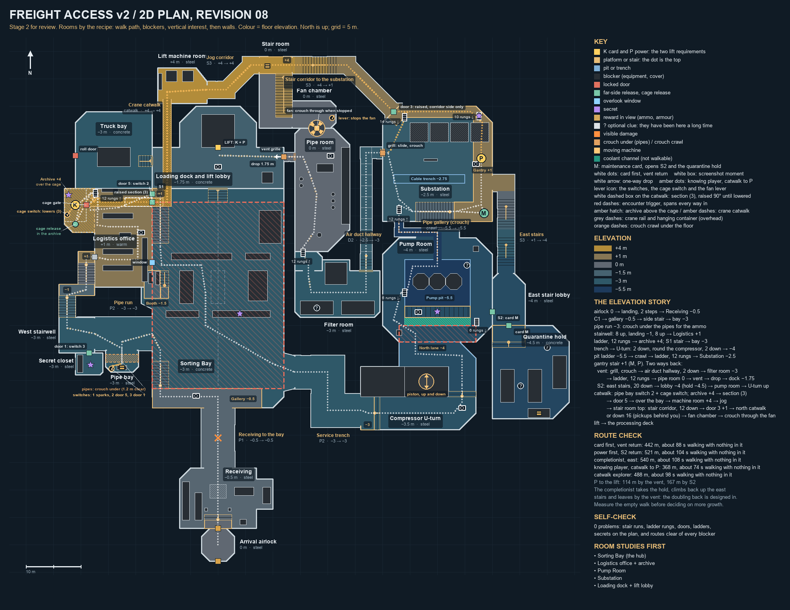

# Freight access v2: the 2D plan (stage 2)

Status: **revision 08**, 2026-09-26; built as the G-01 greybox (stage 3): see [freight-v2-build.md](freight-v2-build.md). Stage 1, the
walkthrough in words ([freight-v2-walkthrough.md](freight-v2-walkthrough.md)),
was approved with notes and matches this revision. Nothing is built yet.



**Files:**
- `tools/freight_v2.py` is the single source of truth for rooms, levels,
  corridors, stairs, ladders, blockers, crouch-unders, one-way drops, moving
  machines, openings, doors, triggers, objectives, secrets, rewards, clues
  and routes.
  The 3D build reads the same module. Running it prints route lengths and
  runs the self-checks.
- `tools/draw-freight-v2-plan.py` draws `freight-v2-plan.png`, and refuses to
  draw while any self-check fails. Label positions live in the drawing
  script; every shape comes from the data module.

**Conventions:**
- Plan metres, x east and y north. The airlock centre is (0, −25).
- Heights are floor elevations relative to the airlock floor (0). The colour
  ramp runs from −5.5 (deep blue) to +4 (amber).
- Kit dimensions: risers 0.25 m, treads 0.5 m, rungs 0.25 m, P1/P2 corridors
  6 m wide with a 4 m lane, S3 service stairs 3 m wide, D2 duct hallways
  2 m wide with a tiny rib at every 2 m join, crouch crawls 1.1 m high.

## Revision 02: the user's review of revision 01

- **"Stair hall west looks massive."** It was a 6 m P2 corridor with the
  stair filling its full width, twice the width of every other flight. The
  east loop had the same fault.
  - Every flight is now 3 m wide (3.5 m at most) in a stairwell that wraps
    it. The dock steps narrowed from 8 m to 3.5 m.
  - **A self-check enforces it:** a flight of more than two risers wider than
    3.5 m fails the drawing. Two-step drops may still span a room.
- **"Grow: we stitched the rooms together without filler rooms."** Two
  fillers are added, one per branch, each with a single idea:
  - **Pipe run (west):** a hallway with an extension. A bank of pipes crosses
    the side bay with 1.2 m clear underneath. You see the ammo container
    beyond, and crouch under to get it.
  - **Compressor U-turn (east):** a U round an air compressor whose piston
    rises and falls. The spine wall makes it a real U. It is the user's
    example sequence: two steps down, round the machine, back the way you
    came, two more down.
- **"The east stairs need a reason."** They lead to a **stair lobby** at the
  pump room's level with two locked doors, and **card M**, found beside P,
  opens both:
  - **S2**, the pump room's east door, seen locked from the bridge on the
    first visit: the easy way back.
  - **The quarantine hold**, a new optional room with a supply cage and the
    level's strongest long-presence clue.

  After P, the gantry leads down these stairs; the only other way out is the
  crawl. Revision 01's separate S2 corridor from the substation to the dock
  is gone.

## Revision 03: the user's sketch on revision 02

"More density on the east; leave the west smaller, it looks interesting."
The sketch filled the empty band between the bay and the Pump Room and
Substation with **the vent way back**, laid out contents first:
1. **A grill** low in the Substation's west wall. It slides open with an
   interaction, and you crouch through into an **access corridor** running
   south. (Revision 04 made it a bare duct hallway and removed its second
   crouch.)
2. **The filter room:** filter banks along the south wall and a blower that
   pushes the north wall into a niche. It is left by the **ladder room**:
   12 rungs up through a hatch into
3. **the pipe room:**
   - pipes come up out of the floor and turn into the walls
   - a rack runs the room's length
   - a big **box fan** turns slowly (revision 04 moved it to the north
     wall)
4. **A vent** in the north-west corner. It opens high in the dock's east
   wall, and you **drop 1.75 m** onto the dock beside the lift.

**It is one way only.** From P to the lift it is 114 m by the vent against
167 m by S2, but the point is that it is another path. The completionist
takes the quarantine hold down the east stairs, climbs back up, and leaves by
the vent, so the doubling back is part of the design.

## Revision 04: the user's notes on revision 03

1. **The box fan moves to the pipe room's north wall**, centred between the
   chamfered corners. You see it turning just before you crouch into the
   vent to the lift.
2. **One crouch, then run.** The fallen cable tray's second crouch is gone
   ("that's adding extra time").
   - The access corridor is now an **air duct hallway**: you crouch through
     the grill into the duct, then run down a cramped, 2 m-wide passage.
   - It has bare metal siding and basically zero detail, only a **tiny rib at
     every 2 m** where the steel sheets join.
   - The sparking fitting that was in it is removed too.
3. **Answers:**
   - No new enemy or weapon for this level yet.
   - The cage waits for the user's west review.
   - The compressor U-turn is liked.
   - Fans are moving parts as well, and **small spinning bits and pumps can
     be set into the walls of other rooms**.

## Revision 05: the user's sketch on revision 04

The crane catwalk is a shortcut from the west to the pipe room, the way to P
that skips "the hubbub". The sketch reroutes it through pass-through rooms
instead of running it straight across:
1. **Crane catwalk** (+4): out of the archive, over the Logistics desks and
   the bay's north end, then **north out of the bay** over the dock's west
   end. It is still gated by the crane panel in the sorting booth.
2. **Lift machine room** (+4): a pass-through beside the lift shaft, with two
   hydraulic pumps and a cabinet **on your left** as you walk through.
3. **Jog corridor** (+4): 3 m wide, with one jog so it is not a long
   straight.
4. **Stair room** (+4 → 0): a top landing, then 16 risers down along the west
   wall. **The pickups are under the landing behind you**, seen only when you
   turn round at the bottom.
5. **Fan chamber** (0): the back of the pipe room's fan, now 4.5 m across.
   **A lever stops it** (it spins down and stops blade-up) and you **walk
   through the blades** into the pipe room. There is no lever on the pipe
   room side, where the fan is a solid spinning disc. Once stopped it stays
   stopped.

**The one-way fan, checked:** a 4.5 m, three-blade fan with its centre at
2.5 m, stopped with one blade pointing up, leaves a 120° gap below the hub.
That gap is about 2.4 m wide at head height (1.8 m), less the blade width,
and the housing lip is 0.25 m, under the 0.3 m step. You walk through
standing; it is not another crouch. The user's alternative, two fans with a
one-way door between them, is kept as a fallback if the walk-through does
not read in 3D.

## Revision 06: the user's sketch on revision 05

1. **Stair corridor and door 3:** from the stair room's top landing, a 3 m
   corridor runs east and then 45° south-east to **door 3** in the
   Substation's north-west corner.
   - Door 3 opens only from the corridor side, then stays open.
   - The corridor drops 6.5 m, from the catwalk's +4 to the Substation's
     −2.5, in two 13-riser flights: one in each leg, with a landing at the
     bend.
2. **The stair room's flight moves to the east wall.** At the bottom you turn
   left and go straight out to the fan chamber. The pickups under the
   landing are behind you to the right, found only by exploring. On the west
   wall they were in view as you left the stair.
3. **The jog corridor moves north** to meet the new top landing.

**Does it shorten the run? Yes.**
- From K to P it is 127 m by the stair corridor and door 3, against 191 m
  down through the fan, the pipe room and the duct.
- The whole knowing-player route is 432 m, down from 511 m.
- **It is light on enemies** (user), so it is the fastest route in time as
  well.
- The fan branch becomes the explorer's: the pickups, the fan moment, and a
  way into the pipe room.
- Going home from the archive by the catwalk and the fan (107 m) is longer
  than by S1 (45 m), so it is not a return route.

## Revision 07: the user's notes on revision 06

1. **Door 3 is raised (+1)** onto a new **north catwalk** along the
   Substation's north wall, above the cage row and the alley behind it.
   - The catwalk joins the east arm, so the gantry is a U.
   - A 14-rung ladder drops from the catwalk to the floor near the grill.
   - The stair corridor needs only one 12-riser flight.
   - Arriving by door 3, you walk the catwalk to P and take the ladder down
     to the vent way.
2. **The fan is 3 m, crouch-through** ("doesn't have to be so big that we
   walk without crouching"), with a smaller fan chamber.
   - Stopped blade-up, it leaves a gap about 1.1 m wide at the top of a
     crouching player.
   - The hub clears the player, and the lip is 0.25 m.
   - `check()` now verifies this.
3. **The booth crane panel is gone.** Skipping the east side on a first run
   is welcome, but it takes mechanical movement:
   - **Pipe bay switch panel** (behind the pipes, beside the ammo):
     - switch 1 sparks and does nothing
     - switch 2 opens **door 5** high in Logistics' east wall, where the
       catwalk leaves for the bay (swapped in revision 08)
     - switch 3 opens **door 1**, heard from the pipe bay, onto a **secret
       closet** off the stairwell's ground landing (armour and health)
   - **The cage switch** (inside the cage, beside K) lowers **catwalk
     section (3)**. It is the last 5 m before door 5, hinged at the door and
     standing at 90° until lowered.
   - The archive lever still opens the cage.

**Distances:**
- From K to P it is **108 m** by the stair corridor, door 3 and the north
  catwalk, against 215 m down through the fan and the duct.
- The knowing player's whole route is **362 m**, down from 432 m.

## Revision 08: the user's notes on revision 07

- **Switches 2 and 3 swap.** Switch 2 opens the distant door 5 for the
  catwalk. Switch 3, the last, opens the nearby secret door 1. A player who
  stops once the catwalk door has clunked open may never find the closet.
- **Section (3)'s hinge side does not matter.** It stays drawn at door 5.
- **The sorting booth stays, as a booth that looks the part.** It sits in the
  bay's west notch under the Logistics floor, with a seat with a console and
  a seat with a joystick at the glass. **Nothing in the game is labelled**;
  props tell the story.
- The bay floor keeps its things: the conveyors, the container stacks and the
  cracked container. It is not open floor.

## Self-checks (0 problems)

`freight_v2.check()` fails the drawing if any of these is violated:
- Every blocker sits inside its room.
- Every stair and corridor slope has at least 0.5 m of run per 0.25 m riser.
- Flights of more than two risers are 3.5 m wide at most.
- Every ladder is a whole number of rungs.
- Every crouch-under clears a 1.1 m crouch.
- The stopped fan passes a crouching player: the lip is no higher than a
  step, the hub clears the crouch height, and the gap between the lower
  blades is wide enough.
- Every drawbridge section lies on a catwalk.
- Every drop is one way and 2 m at most, and starts and lands on the plan.
- Every ladder, door, opening, objective, secret, reward, clue, damage point
  and screenshot spot is on a room, level or corridor.
- Both routes stay on the floor plan and clear every solid blocker by the
  player radius (0.3 m).
- Legs that are off the ground floor (the archive, the cage, the crawl) or
  crouched are tagged and skip the blocker test.

Revision 02's first run found 11 problems, all fixed:
- the supply cage outside the hold's chamfer
- the hold door and route in the wall gap between two rooms
- routes through a quarantine container and a moved container stack

## Rooms

| Room | Floor | Size (clear) | Built from |
|---|---:|---|---|
| Arrival airlock | 0 | 6 m octagon | Plain chamber for now (FR-007 later) |
| Receiving | −0.5 | 14 × 11 m, east booth | Landing, 2 steps, decon arch, desk, racks |
| Sorting Bay (hub) | −3.0 | 24 × 38 m, bulge and notch | Gallery −0.5, conveyors, containers, crane |
| Pipe run + pipe bay | −3.0 | 10.5 m P2, 6 × 4 m bay | Pipe bank at 1.2 m clear, ammo in view |
| West stairwell | −3.0 → +1 | 6.5 × 18.5 m zigzag | Two 3 m flights, landing −1 |
| Logistics office | +1.0 | L, 16 × 18 m | Desks, dispatch counter, cage; archive +4 above |
| Compressor U-turn | −3.0 → −4 | 21 × 16 m | Compressor with piston, spine wall, 2 + 2 steps |
| Pump Room | −4.0 | 20 × 19 m, chamfered | Ring walkway round a −5.5 pit, bridge, 3 pumps |
| Substation | −2.5 | 20 × 21 m, chamfered | Cage row, cable trench, L gantry +1 with M and P |
| East stair lobby | −4.0 | 6 × 9.5 m | Foot of the east stairs; S2 and the hold door |
| Quarantine hold | −4.5 | 14 × 17 m, chamfered | Quarantine containers, one burst, supply cage |
| Air duct hallway | −2.5 → −3 | 2 m D2, 24.5 m | Grill crouch in, bare steel, tiny ribs every 2 m, 2 steps down |
| Filter room | −3.0 | 15.5 × 8.5 m, niche | Two filter banks, blower |
| Ladder room | −3.0 | 5 × 3.5 m | Ladder, 12 rungs, to the pipe room |
| Pipe room | 0.0 | 10 × 22.5 m, chamfered | Floor risers into the walls, a rack, the big fan in the north wall |
| Crane catwalk | +4.0 | 1.5 m grating, 31 m | Over Logistics, the bay and the dock; section (3) and door 5 |
| Secret closet | −3.0 | 5 × 4 m | Behind door 1 (switch 3): armour and health |
| Lift machine room | +4.0 | 9 × 6.5 m | Two hydraulic pumps and a cabinet on the left |
| Jog corridor | +4.0 | 3 m S3, 11 m | One 45° jog |
| Stair room | +4 → 0 | 6 × 13 m | The fork: 16-riser flight on the east wall, the pickups under the landing |
| Stair corridor | +4 → +1 | 3 m S3, 22 m | One 12-riser flight, raised door 3 (corridor side only) |
| Fan chamber | 0.0 | 8 × 5 m | The 3 m fan's back, the lever |
| Loading dock + lift lobby | −1.75 | 24 × 7.5 m dock, 14 m lobby | Lift cage, pallets, dock edge |
| Truck bay | −3.0 | 14 × 14 m | Cargo hauler, sealed roll door |

## Where things are

- **K (freight clearance card):** in the supervisor cage (−26, 37), in
  Logistics' north-west corner.
  - The cage gate faces a narrow alcove between the cage and the lockers.
    The **archive ladder** (12 rungs, +1 → +4) stands in that same alcove.
  - The archive floor covers the cage. Its rolling-shelf maze runs from the
    ladder hatch (NE) to the **cage release** (SW), with the **drawer-bank
    secret** in the NW.
- **M (maintenance card):** in the gantry's corner control booth (48.5,
  35.5), passed on the way to P.
- **P (power restore switch):** at the north end of the gantry's east arm
  (48, 45.5). It overlooks the cage row.
- **S1:** in Logistics' east wall at (−12, 39). It opens onto a +1 landing
  and the 16-riser service stair down the bay's west wall.
- **S2:** the pump room's east door at (50, 17.5), in line with the bridge.
  Card M opens it from the stair lobby.
- **The lift gate:** at (0, 47.5), and it needs K and P. It is reached by the
  3.5 m dock steps from the bay.
- **The grill** is in the Substation's west wall at (30, 46.5). **The vent
  grille** is in the dock's east wall at (12, 45.75), 1.75 m above the dock
  floor.
- **Logistics is entered by its west door** (−22.5, 27.5), at the top of the
  stairwell, into the aisle between the first two desk rows.

## Progression and routes

```
Receiving -> Bay (fight) -+-> pipe run -> stairwell -> Logistics -> archive (release) -> cage (K, fight) -> S1 -> Bay
                          +-> trench -> U-turn -> Pump Room (fight) -> pit -> crawl -> Substation (M, P, fight)
                                -> grill -> air duct hallway -> filter room -> ladder -> pipe room -> vent -> drop -> dock
                                -> east stairs -> lobby -(M)-> hold (optional) / S2 -> Pump Room -> U-turn -> trench -> Bay
Knowing player: pipe bay switch 2 + cage switch -> archive -> section (3) -> door 5 -> catwalk -> machine room
                -> jog -> stair room -> stair corridor -> door 3 -> north catwalk -> P -> ladder -> vent way
Explorer:       + switch 3, door 1 and the closet; ... stair room -> down (pickups) -> fan chamber (lever)
                -> crouch through the fan -> pipe room -> ladder
                -> filter room -> duct -> grill -> Substation (M, P) -> vent way
Lift gate: K and P, either order -> final hold -> lift
```

| Route | Length | Empty walk | Notes |
|---|---:|---:|---|
| Card first, vent return | 436 m | about 87 s | plus 5 ladder climbs, 2 crawls, 2 crouches and the drop |
| Power first, S2 return | 514 m | about 103 s | takes the hold; the U-turn and the trench both ways |
| Completionist | 535 m | about 107 s | card first, the hold, back up the east stairs, out by the vent |
| Knowing player, catwalk to P | 362 m | about 72 s | switch 2, K and the cage switch, catwalk, door 3, P, ladder, vent |
| Catwalk explorer | 482 m | about 96 s | plus the closet; down the stair room, through the fan and along the duct |

**The knowing player's route is the shortest and, being light on enemies,
the fastest.** It skips the trench, the U-turn, the Pump Room, the pit and
the crawl. Seeing everything still takes more than one run, because the
catwalk rooms are reached only from the archive.

**Earlier revisions:** revision 01 was 293 m and 350 m. Revision 02 was
531 m and 513 m, and both of its routes returned through the U-turn.

**The S2 return walks the U-turn and the trench in both directions.** That
return needs its own beat, and the U-turn is the natural place for a return
ambush. The enemy pass decides.

**Newcomer mistakes:**
- Trying S2 from the pump room: it is locked, and a window shows the stair
  lobby. The pit ladder is the way on, and the bridge-crawl secret is beside
  the door.
- Trying the lift early: the display lists what is missing.

**Triggers are unmissable.**
- The bay fight covers the whole bay floor.
- The pump fight covers the whole south walkway, the only way in on a first
  visit.
- The other three fights are event triggers: the cage opening, the power
  restore and calling the lift.

## Elevation tally

| Step | Where | Change | Height |
|---|---|---|---:|
| 1 | Airlock → Receiving | landing, two steps down | −0.5 |
| 2 | C1 → gallery | level | −0.5 |
| 3 | Gallery → bay floor | side stair, 10 risers down | −3.0 |
| 4 | Pipe run | level; crouch under the pipes | −3.0 |
| 5 | West stairwell | 8 up, landing −1, 8 up | +1.0 |
| 6 | Logistics → archive | ladder, 12 rungs | +4.0 |
| 7 | S1 service stair | 16 risers down | −3.0 |
| 8 | Compressor U-turn | 2 down, round the machine, 2 down | −4.0 |
| 9 | Pump pit | ladder, 6 rungs down | −5.5 |
| 10 | Pipe gallery | crouch crawl, then ladder, 12 rungs up | −2.5 |
| 11 | Substation gantry | side stair, 14 risers up | +1.0 |
| 12a | Vent way: grill, air duct hallway | crouch through, two steps down | −3.0 |
| 12b | Vent way: ladder room → pipe room | ladder, 12 rungs up | 0.0 |
| 12c | Vent way: vent → dock | crouch, then drop 1.75 m | −1.75 |
| 13 | Or the east stairs | 10 down, landing, 10 down | −4.0 |
| 14 | Quarantine hold | two steps down (optional) | −4.5 |
| 15 | Back through the U-turn | 2 up, round the machine, 2 up | −3.0 |
| 16 | Dock steps | five up | −1.75 |
| 17 | The lift | down to the processing deck | — |
| K1 | Knowing player: archive → catwalk → machine room → jog | level, high over the bay | +4.0 |
| K2 | Stair corridor → raised door 3 → north catwalk | 12 down | +1.0 |
| K2a | North catwalk → ladder → Substation floor | ladder, 14 rungs down | −2.5 |
| K3 | Or the stair room | 16 risers down; the pickups behind you, to the right | 0.0 |
| K4 | Fan chamber → through the stopped fan → pipe room | step over a 0.25 m lip | 0.0 |

## Duration

- **The old freight blockout:** the user's empty run took 296 s over
  1,958 m.
- **The encounter route test:** 114 m with twelve bugs took 53.88 s in the
  accepted human playtest.
- **Revision 07:** 362–535 m, and about 70–110 s empty before the ladders,
  crawls, crouches and interactions.

It is still an estimate, not a measurement. The room studies will show real
time per room. More growth, if it is needed, is decided on the empty walk,
before the level is composed.

## Open questions

1. **Room studies:** the five were Sorting Bay, Logistics with its archive,
   Pump Room, Substation, and the dock with the lift lobby. Should the
   compressor U-turn or the pipe room replace one? They hold the level's two
   moving machines.

**Decided:**
- No new enemy or weapon for this level yet.
- The compressor U-turn is liked.
- Small spinning bits and pumps go into the walls of other rooms.
- One big fan you crouch through.
- Door 3 is raised onto a Substation catwalk.
- Finding the catwalk shortcut on a first run is welcome; it takes switches
  and mechanical movement, not a knowing-player lock.
- The archive lever opens the cage.
- The switch chain:
  - Switch 1 sparks.
  - Switch 2 opens door 5.
  - Switch 3 opens the secret door 1.
  - The cage switch lowers section (3), hinged at either side.
- The booth stays, with seats and a console.
