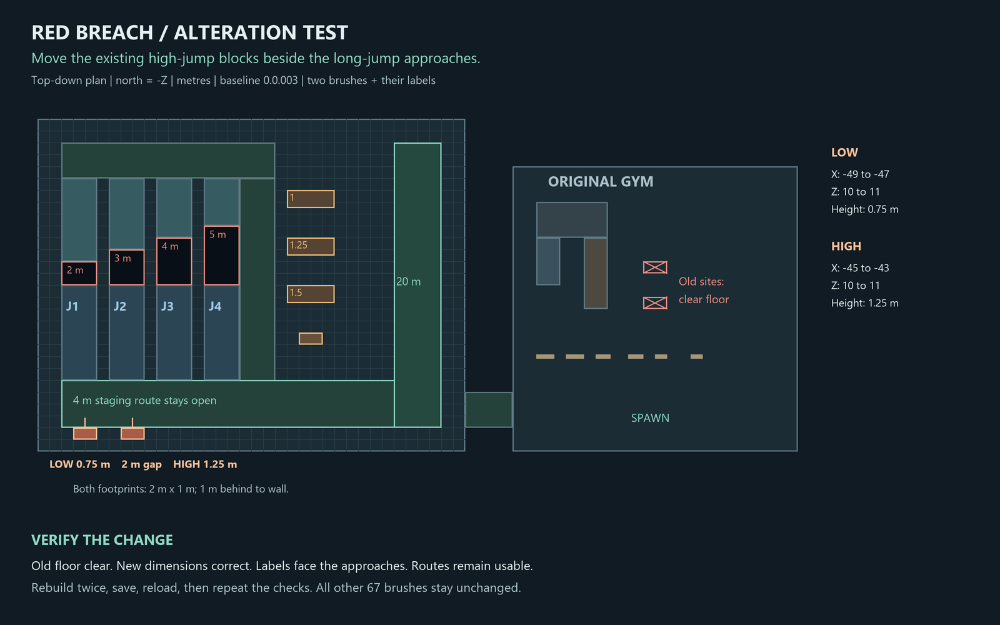

# High-jump relocation: alteration plan

Status: relocation built, source-to-Godot pipeline validated, and accepted by the user. Included with the subsequent pistol pass in local version `0.0.004` (Weapons). The user accepted the Movement Gym playtest and requested this alteration. The layout was planned before editing geometry, from local commit `53047eb` (Movement Gym), version `0.0.003`.

Move the original two high-jump brushes to the south edge of the annex, beside the long-jump approaches. Keep their 2 m by 1 m footprints, heights, and materials. Place them side by side with a 2 m clear gap. Keep the 4 m staging route at Z = 6..10 and 1 m behind the blocks to the south wall. The stations have no triggers or recovery points to relocate; move only their existing labels, facing north toward the approaches.

| Block | Old X / Z bounds | New X / Z bounds | Translation (X,Y,Z) | Height |
|---|---|---|---|---|
| Low | -1..1 / -1..0 | -49..-47 / 10..11 | (-48, 0, 11) | 0.75 m |
| High | -1..1 / -4..-3 | -45..-43 / 10..11 | (-44, 0, 14) | 1.25 m |

The original gym becomes clear at both old sites. Preserve all 67 other brushes, long-jump origins/reset points, runway, crouch tests, doors, targets, lighting, and player tuning. Mark the move complete only after source diff, baked collision, label placement, repeated builds, save/reload, route traversal, and the full gym validation pass agree.

There are no new story beats, items, encounters, or progression changes in this mechanics test. The relocation was tested against version `0.0.003` and is included in the later local Weapons commit, version `0.0.004`.

The Windows computer-use runtime could not start (`helper_sandbox_lock_failed`, `SetNamedSecurityInfoW ... 5`). This run edits the Valve 220 source file directly and validates func_godot build/save/reload. It does not claim a TrenchBroom editor UI round trip.

## Verified result

- Only the two existing cover brushes changed. All other 67 source brushes are identical to commit `53047eb`; brush count stays 69. Heights, footprints, texture axes, and materials are preserved.
- Both old footprints are now floor at Y = 0, with no leftover blocking collision. Both labels moved and face north toward the approaches.
- New centers are (-48, 0.375, 10.5) and (-44, 0.625, 10.5), measured at brush centers. Both bases remain at Y = 0.
- The player can walk through both old sites and across the full staging route. The 0.75 m block is reachable from the floor; the 1.25 m block still rejects a direct floor jump but is reachable from the low block.
- Two independent source rebuild/save/reload cycles preserve dimensions, labels, collision count, and authored gameplay nodes. Tests write temporary scenes only under ignored `.godot` and verify the canonical source and scene remain unchanged by QA.
- Validation passes: 30 baseline gym + 22 movement + 32 door + 58 annex + 32 alteration = **174 checks, zero failures**. The new regression lives in `RedBreach/tools/validate_alteration.gd` and is included by `tools/rebuild-gym.ps1 -Validate`.
- Forward+ / D3D12 captures of the new station, cleared old sites, and overview were visually inspected. Evidence is under ignored `RedBreach/.godot/`: `alteration_qa.log`, `alteration_source_audit.json`, `alteration_capture.log`, and `alteration_*.png`.

Practical finding: source geometry alterations survive rebuilding. Authored Godot labels still require a matching edit; they do not follow a brush automatically. This run verifies the file-to-game part of the workflow. It does not verify editing/saving the map through the TrenchBroom UI.

## Playtest the move

Start a fresh F5 run. Enter the annex and walk to the long-jump approaches, then turn toward the south wall to find both height blocks. Try floor-to-low and low-to-high jumps. Return to the original gym to confirm the old positions are clear. Save or reload any open editor scene as appropriate before rebuilding it again.

The relocation itself changed no controller tuning. It is included with the subsequent pistol work in local version `0.0.004` (Weapons), with no push.
