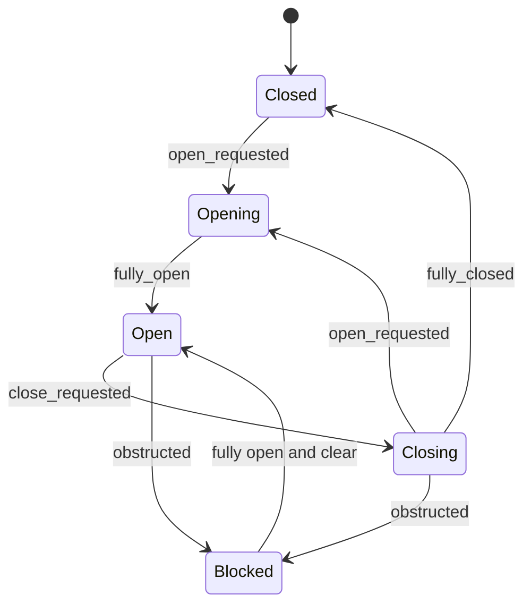

# Door module plan

The next gym module fits the existing 2.0 m doorway at Godot (2, 0, 4). The approved gym's map geometry stays authoritative; the reusable door is an authored scene alongside Geometry.

## Top-down placement

```text
               NORTH / -Z
         SwitchBack at (3.5, 1.35, 3.66)
                         [E]
        left post | <- | -> | right post
                  2 m opening
                         [E]
         SwitchFront at (3.5, 1.35, 4.34)
               SOUTH / SPAWN
```

Two horizontal leaves retract into the existing side posts. Both switches operate the same door. This is an interaction test with no new story beat, key, item, or enemy.

## Behavior

- Aim at either switch within 2 m; press E once. Solid geometry blocks interaction rays.
- Closed -> Opening -> Open. Opening ignores repeat requests until complete.
- Open -> Closing -> Closed. Pressing E while closing reverses to Opening.
- A CharacterBody3D or RigidBody3D in the doorway prevents closure. If one enters while closing, the door reverses through Blocked.
- Blocked opens fully and waits for clearance, then returns to Open. Another press is required to close; no automatic repeated closing attempts.
- Lights and text communicate state. Collision follows the moving leaves.

## Editable State Chart

Open `RedBreach/interaction/sliding_door.tscn`. Expand `StateChart/Movement` to see Closed, Opening, Open, Closing, and Blocked with their Transition children. Editor tracking is enabled.

The chart owns transitions. State signals drive movement and feedback in `sliding_door.gd`; the switches only send requests. The player owns aim/range testing and the E prompt.

Reference: [State Charts nodes and signals](https://derkork.github.io/godot-statecharts/usage/nodes).

## State flow



Travel takes 0.8 seconds. Each leaf moves 1.05 m sideways. Amber means closed, yellow means moving, green means open, and red means blocked; text states accompany the colors.

Tracking remains enabled when a debugger is connected (normal F5 use). Standalone/test runs turn it off before chart initialization because the installed addon otherwise tries to send debugger messages without a connection.

## Playtest

1. Stop the running game, then press F5.
2. Go to the 2.0 m doorway labeled **04 / DOOR TEST**.
3. Aim at the colored switch on the right post within 2 m. Press E to open.
4. Walk through and close it using the switch on the other side.
5. Press again during closing to reverse it, or move into the threshold while it closes. It should reopen and wait.
6. Clear the threshold and press E again when you want it to close.

The 1.0 m and 1.5 m doorways remain clearance gauges. The test prop shown in the validation captures is temporary and is not part of the saved gym.

## Validation

- 32 door checks passed: both switches, physical E input, range, wall occlusion, solid/clear passage, repeated requests, manual reversal, stationary and moving obstructions, rigid-body props, independent instances, and surviving a map rebuild.
- All 30 baseline gym checks and 11 camera/motion checks also passed: 73 automated checks total.
- Closed, open, blocked, and switch-prompt views rendered successfully with Forward+ / D3D12. Visual inspection caught and corrected reversed rear-facing labels.
- Build, gym, motion, door, and capture logs contain no script errors. Version stays 0.0.001; no commit was made.

Use `tools/rebuild-gym.ps1 -Validate` to run the combined suite. Door-specific logs/captures are in ignored `RedBreach/.godot/`: `door_qa.log`, `door_capture.log`, and `door_*.png`.
