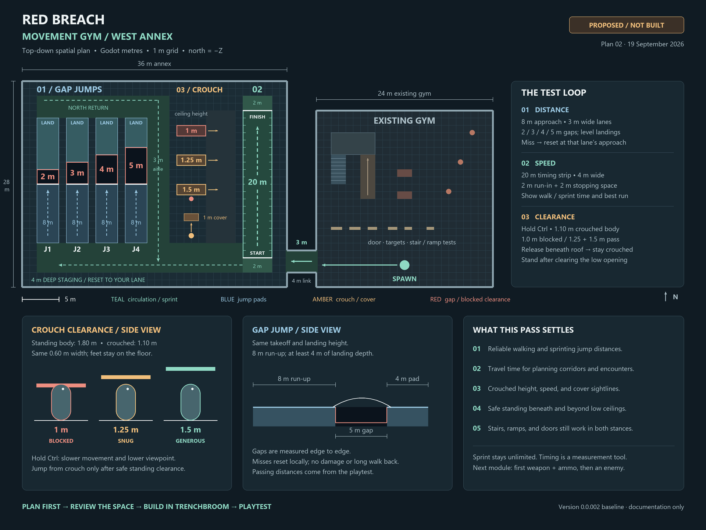

# Movement gym extension: west annex

Status: spatial plan approved; annex built, validated, and accepted in the user's first playtest. The drawing below preserves the original approved planning artifact; see [playtest 03](gym-playtest-03.md) for implementation results. The subsequent [high-jump alteration plan](gym-alteration-plan.md) supersedes the two block positions shown here.

Editable vector drawing: [gym-movement-plan.svg](gym-movement-plan.svg). Baseline: local commit `104fae9`, version `0.0.002`.

## Layout and route

Add a **36 x 28 m annex west of the existing 24 x 24 m gym**. A **4 m long, 3 m wide connector** enters through the clear southwest part of the old gym, behind the doorway tests. The only alteration inside the original gym is that opening in its west perimeter wall. Retain its spawn, door/switch module, targets, cover, stairs, and ramp in their current positions.

From spawn, walk west through the connector into the south staging area. Choose a jump lane, the sprint runway, or a crouch tunnel. Successful jumps reach a common north return strip and a 3 m aisle back to staging. The crouch tunnels connect that aisle to the open space beside the runway; both ends stay accessible. All tests can be repeated independently.

The annex keeps a 4 m perimeter enclosure and open ceiling. Normal floor and jump pads are at Y = 0. Pit floors are at Y = -1.5 m. Dimensions below are clear space, with structural wall thickness added outside those bounds.

World coordinates use Godot X/Z in metres; north is -Z. Existing map conversion remains 32 map units per metre.

| Element | X extent | Z extent | Notes |
|---|---:|---:|---|
| Existing gym | -12 to 12 | -12 to 12 | Current stations retained |
| Annex | -52 to -16 | -16 to 12 | 36 x 28 m clear footprint |
| Connector | -16 to -12 | 7 to 10 | 4 m long; 3 m clear width |
| Jump staging | -50 to -18 | 6 to 10 | 4 m depth; joins all approaches |
| North return | -50 to -32 | -14 to -11 | 3 m depth |
| Jump return aisle | -35 to -32 | -11 to 10 | 3 m clear width |
| Sprint runway | -22 to -18 | -14 to 10 | 4 x 24 m overall |
| Crouch exit aisle | -27 to -23 | -12 to 6 | Clear access to the east ends |

## 01 / Horizontal jump distance

Use the existing jump, at walking and sprinting speeds. Every lane is **3 m wide**, with an **8 m run-up**, a takeoff edge at Z = -2, and an equal-height landing pad. One-metre divider strips separate the lanes; these are circulation margins, not part of a scored jump.

| Lane | X extent | Clear gap | Pit Z extent | Landing pad Z extent |
|---|---:|---:|---:|---:|
| J1 | -50 to -47 | 2 m | -4 to -2 | -11 to -4 |
| J2 | -46 to -43 | 3 m | -5 to -2 | -11 to -5 |
| J3 | -42 to -39 | 4 m | -6 to -2 | -11 to -6 |
| J4 | -38 to -35 | 5 m | -7 to -2 | -11 to -7 |

Run-up Z extent is -2 to 6 for every lane. Landing depth varies from 7 to 4 m, giving all lanes a shared north return. Mark the gap distances **edge to edge**, with takeoff and landing edges clearly visible. Keep the gaps physically open in the collision geometry.

A clean attempt starts in its marked approach, becomes airborne from that approach, and lands on the matching pad. Walking around or landing on a divider does not count. Show the lane, walking/sprinting mode, result, and horizontal takeoff-to-landing displacement. Test both comfortable jumps and attempts near the limit.

On a miss, entering that pit below Y = -0.8 m resets the player to the lane centre at Z = 5, facing north, with velocity and camera history reset. The pit is 1.5 m deep and nonlethal. Each attempt has a local recovery point; Backspace returns to the main gym spawn (the pistol pass reassigned R to reload).

Current idealized same-height flight time is about 0.69 s, giving roughly 3.44 m of walking travel or 5.50 m of sprint travel. These are estimates from the current controller values, not guaranteed clear-gap distances: collision edges and takeoff timing affect real results. Record the usable distances from playtesting before designing level gaps around them.

## 02 / Sprint runway

Use a **20 m measured strip**, with **2 m of approach** before the start and **2 m after the finish**. Run north from the south staging area:

- Approach: Z = 10 to 8.
- Start line: Z = 8.
- Finish line: Z = -12.
- Stopping space: Z = -12 to -14.

Time the player crossing the two planes while remaining inside the lane. Show run mode, elapsed time, and a separate best time for walking and sprinting. Side entry does not start a run. Leaving the lane, turning back, jumping, crouching, or changing speed mode cancels the measurement and allows a fresh attempt. Re-enter from the approach to rearm it.

With the current 5 m/s walk and 8 m/s sprint, constant-speed reference times are **4.0 s walking** and **2.5 s sprinting**. The runway measures travel; sprint remains unlimited and has no stamina countdown in this pass. It does not gate access to other stations.

## 03 / Crouch clearance and cover

Implemented initial crouch tuning:

| Property | Standing | Crouched |
|---|---:|---:|
| Body height | 1.80 m | 1.10 m |
| Body diameter | 0.60 m | 0.60 m |
| Eye height | 1.65 m | 0.95 m |
| Ground speed | 5 m/s walk; 8 m/s sprint | 2.5 m/s |

Hold **Ctrl** to crouch. Keep feet at their current height while the body becomes shorter and the camera lowers smoothly. Releasing Ctrl requests standing; remain crouched while there is insufficient clearance, then stand once clear. Holding sprint during crouch keeps the crouch speed. Preserve the existing jump tuning: Space from crouch first requires room to stand, then performs the normal jump; a low ceiling prevents the action. For this first pass, posture changes occur on the ground; airborne crouch/slide behavior is left for a separate design decision.

Three east/west tunnels each have **4 m clear length and 1.5 m clear width**, with open approaches at both ends. Their clear roof heights fit our quarter-metre map grid:

| Tunnel | X extent | Z extent | Clear height | Expected result |
|---|---:|---:|---:|---|
| C1 | -31 to -27 | -10 to -8.5 | 1.00 m | Blocks even when crouched |
| C2 | -31 to -27 | -6 to -4.5 | 1.25 m | Pass crouched; cannot stand inside |
| C3 | -31 to -27 | -2 to -0.5 | 1.50 m | More generous crouched passage; cannot stand inside |

Add **1 m high cover**, 2 m wide and 1 m deep, at X = -30 to -28, Z = 2 to 3. A static probe target at (-29, 0.8, 0), viewed from approximately (-29, 0, 5), tests visibility and shot obstruction over the cover in both postures. The solid cover should block the crouched view/probe; standing should clear it. This is a sightline test using the existing probe, with no combat encounter.

Use the State Charts addon for the posture states when implementing crouch, and the existing movement controller for motion and verified ground support. Keep the collision capsule, eye height, and posture feedback synchronized. Gameplay nodes and test triggers stay outside the regenerated Geometry subtree.

## Materials and labels

Use the supplied **plain Kenney grids**: Light/Dark as the neutral base, a consistent cool color for jump lanes, Green for the runway/return path, and Orange for crouch tests. Label stations with text as well as color. Existing gym textures remain as the comparison baseline.

Use `texture_01.png`, `texture_03.png`, or `texture_05.png` from the chosen color set at **0.03125 face scale**: a full 1024 px repeat covers 1 m, with 0.125 m fine squares. Follow [blockout texture conventions](blockout-textures.md). Opening geometry follows the planned clearances rather than the pack's door/window diagrams.

## Story, items, and progression

This extension is a reusable mechanics test. Its sequence is arrive, choose a station, read the measurement, repeat, and return. There are no story beats, pickups, keys, locked gates, or enemy encounters in this pass. After movement is comfortable, the next modules are the first weapon and ammo pickup, then a basic enemy, followed by the first real level's 2D plan.

## Build and playtest order

1. Review this spatial plan before changing the map.
2. Build the annex, connector, pits, and clearance geometry in the TrenchBroom source; bake and save the scene.
3. Add local jump recovery and the timing strip; implement crouch posture and safe standing.
4. Test all four gaps walking and sprinting. Record reliable distances and misses.
5. Test all three clearance tunnels, including releasing Ctrl under a roof, approaching both ends, and trying to jump with blocked headroom.
6. Verify cover sightlines and repeat stairs, ramp, door obstruction, and reset tests with crouch enabled.
7. Run the existing rebuild validation plus appropriate new movement checks, then playtest the feel.

This plan has now been implemented in the map, saved gym scene, and player controller. This implementation is saved in local version `0.0.003` (Movement Gym), with no push. Automated measurements and the user playtest checklist are in [playtest 03](gym-playtest-03.md).
