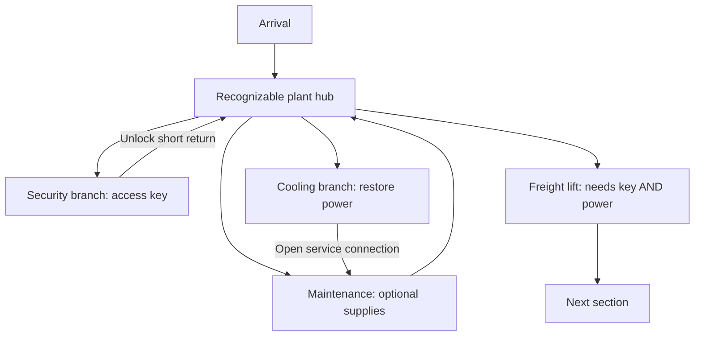

# Level structure: branches, loops and measured pacing

Status: design context for the early-campaign example mission, provisionally level 2 or 3. The reviewed route is now an [empty playable blockout](freight-blockout.md), authorized by the user for a walkthrough before enemy/pickup placement.

## What the test told us

The user's first complete route run took 53.83 s: 20.13 s with active encounters and 33.70 s quiet, travelling 207.7 m along a route with a 102 m marked centreline. Individual encounters resolved in 2.70-4.92 s; all five cleared using 40 shots with 20 damage taken. The user found them very easy. This is one useful sample, not a reliable average or a ceiling on future fight duration. Distance includes combat movement and detours; quiet time includes pauses.

Keep fast kills as part of the game's feel. More enemies, different approach angles, cover, sightlines, simultaneous melee/ranged pressure and reload decisions may change fight duration without increasing enemy health. Those should be playtested for enjoyable pressure, not added solely to pad a clock. Exploration and progression can supply a larger share of level duration.

## Current mission target

The user places the freight-access example around level 2 or 3. Players know the game's basic movement and combat; a new enemy or weapon remains an optional introduction. The broader arc is attack on the colony, discovery of the aliens' long presence, and eventually leaving the planet. Exact revelation timing is open.

Aim for about ten minutes on a normal familiar-player run, with longer first-time exploration and shorter efficient runs. The earlier route tests establish useful components, not a level-duration prediction. Let meaningful branch sequences, combat, navigation and returns supply the content; preserve optional secrets and measure actual runs without padding the clock through empty corridors or forced loading waits.

Frame arrival/departure with persistent airlocks or elevators. The first room after arrival is mostly quiet so the player can orient themselves before pressure begins in onward halls and rooms. The destination title appears once after stepping out and fades over about two seconds. See the [walkthrough and transition intent](example-mission-walkthrough.md) for the agreed direction.

## Plan two related diagrams

**Objective dependencies** describe what unlocks progress: an access key, restored power, a release switch, a cleared obstruction. Use a tree or dependency graph with one entrance and a clear ultimate objective. Mark whether a gate requires both conditions (AND), either condition (OR), or no condition. A key must never be accessible only through its own lock. Required items must remain reachable from every allowed progression state.

**Physical connections** describe where the player can walk. Begin with the objective branches, then connect selected branches through shortcuts, overlooks and loops. A strict tree requires retracing the same edges; a few added connections let progress change how the space is navigated. One entrance does not require one path through every room.

Conceptual example only, with no room sizes or approved placement:

Security and Cooling can be completed in either order. Their objectives both matter; Maintenance is optional. The player sees the blocked lift early and understands why each branch is useful. The shortcuts are unlocked from the far side, so they reward completing a branch without bypassing its purpose.

## What makes a branch worth exploring

A branch is a small sequence, not necessarily one long hallway. Give it a recognizable destination, an approach or landmark, a gameplay problem, a payoff and a return consequence. For example: see Security through a window, enter through a damaged service route, handle a mixed encounter in its working floor, claim the key, then open a short return door beside the hub.

At current tuning, a 200 m path takes 40 s walking or 25 s sprinting each way before turns or interruptions. A blind return on the same path doubles that travel. Those lengths can serve anticipation, scale or a changing return journey, but length alone is not complexity. Use actual required traversal, including revisits, rather than the sum of all corridor lengths on the drawing.

Start with two required branches and one optional branch around a legible hub. Add nesting only when each new decision is understandable. Contrast spaces: a broad work floor, a narrow maintenance approach, a raised overlook, a service loop and a quieter objective room. Reuse tested movement dimensions; reserve long clear runs for places where speed itself matters.

## Room interiors can change height

Use mezzanines, upper entrances, lower working floors and internal stairs as part of room design. A room can connect corridors at different heights while revealing its floor and threats from above, or lead from a lower floor to an upper exit. Consider this throughout the level and vary which rooms use it. Plan the entrance/exit elevations and movement between floors alongside the room's encounters, cover and pickups. The main-floor label on a top-down plan is a reference height, not a requirement for a single-level room. See the [elevation notes](freight-access-elevation-plan.md) for built examples.

## Agreed design process

The user chose staged mission design: walkthrough first, then a reviewed spatial paper plan, then an enemy/pickup pass, then construction and playtesting. The [example mission walkthrough](example-mission-walkthrough.md) and [spatial plan](freight-access-route-plan.md) have been reviewed; the user brought the empty blockout check forward before enemy/pickup placement.

1. Agree on a step-by-step walkthrough: goal, actions, required items, gates, return paths and completion. Identify alternative valid orders and optional exploration.
2. Map the agreed walkthrough spatially on paper, including dimensions, connections, landmarks, gate visibility and shortcut directions. Trace the player's route and understanding; check every key/lock dependency before blockout.
3. Pass through that layout for enemies and pickups. Plan threat angles, warning cues, recovery and ammunition around movement and encounter observations. Revisit the layout when necessary.
4. Build the reviewed plan. Verify empty traversal and progression first, then the populated mission.
5. Playtest, record navigation choices and timing, and revise. Include first-time and familiar-route behavior; avoid inferring total duration by adding overlapping traversal and combat time.

The authorized empty blockout now includes key/locked-door interactions, a lift requiring K+P, and working shortcuts. Walk the scale and routes before the enemy/pickup pass.
