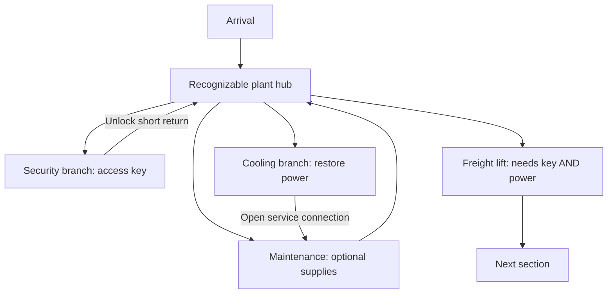

# Level structure: branches, loops and measured pacing

Status: design discussion following the first route playtest. No level-one geometry or new progression system is authorized by this document.

## What the test told us

The user's first complete route run took 53.83 s: 20.13 s with active encounters and 33.70 s quiet, travelling 207.7 m along a route with a 102 m marked centreline. Individual encounters resolved in 2.70-4.92 s; all five cleared using 40 shots with 20 damage taken. The user found them very easy. This is one useful sample, not a reliable average or a ceiling on future fight duration. Distance includes combat movement and detours; quiet time includes pauses.

Keep fast kills as part of the game's feel. More enemies, different approach angles, cover, sightlines, simultaneous melee/ranged pressure and reload decisions may change fight duration without increasing enemy health. Those should be playtested for enjoyable pressure, not added solely to pad a clock. Exploration and progression can supply a larger share of level duration.

## Plan two related diagrams

**Objective dependencies** describe what unlocks progress: an access key, restored power, a release switch, a cleared obstruction. Use a tree or dependency graph with one entrance and a clear ultimate objective. Mark whether a gate requires both conditions (AND), either condition (OR), or no condition. A key must never be accessible only through its own lock. Required items must remain reachable from every allowed progression state.

**Physical connections** describe where the player can walk. Begin with the objective branches, then connect selected branches through shortcuts, overlooks and loops. A strict tree requires retracing the same edges; a few added connections let progress change how the space is navigated. One entrance does not require one path through every room.

Conceptual example only, with no room sizes or approved placement:

Security and Cooling can be completed in either order. Their objectives both matter; Maintenance is optional. The player sees the blocked lift early and understands why each branch is useful. The shortcuts are unlocked from the far side, so they reward completing a branch without bypassing its purpose.

## What makes a branch worth exploring

A branch is a small sequence, not necessarily one long hallway. Give it a recognizable destination, an approach or landmark, a gameplay problem, a payoff and a return consequence. For example: see Security through a window, enter through a damaged service route, handle a mixed encounter in its working floor, claim the key, then open a short return door beside the hub.

At current tuning, a 200 m path takes 40 s walking or 25 s sprinting each way before turns or interruptions. A blind return on the same path doubles that travel. Those lengths can serve anticipation, scale or a changing return journey, but length alone is not complexity. Use actual required traversal, including revisits, rather than the sum of all corridor lengths on the drawing.

Start with two required branches and one optional branch around a legible hub. Add nesting only when each new decision is understandable. Contrast spaces: a broad work floor, a narrow maintenance approach, a raised overlook, a service loop and a quieter objective room. Reuse tested movement dimensions; reserve long clear runs for places where speed itself matters.

## Design process to test next

1. Choose the player objective and define its unlock conditions before drawing rooms.
2. Sketch required and optional branches; mark every key, gate and shortcut direction.
3. Turn that diagram into a top-down spatial plan with dimensions, landmarks, sightlines, encounter positions, supplies and return paths.
4. Assign a purpose to every segment: traversal, combat, navigation choice, discovery, objective or recovery. Remove stretches with no purpose unless they provide deliberate breathing room.
5. Check reachability, alternate completion orders, key/lock dependencies and shortcut unlocks on paper.
6. Play the empty route to measure traversal, then the same route with encounters/objectives. Track decisions, searches and return legs as well as kills. Movement overlaps fighting: do not blindly add raw combat duration to empty travel time.
7. Compare repeated runs, including a player who already knows the route. Build pacing from those observations instead of promising a target duration from room or enemy counts.

A useful next systems experiment would be a reusable key/locked-door pair, a powered gate with two clear requirements, and a shortcut that opens from one side. That would let us test branching progression before committing to a full first level. It remains a proposal for discussion.
